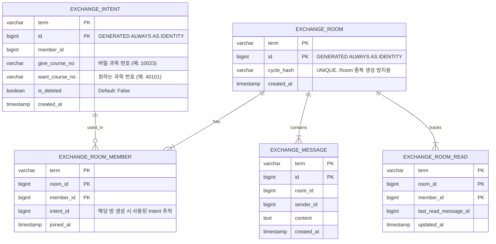

### 수강신청 과목 교환 시스템 설계 문서

---

#### 1. 도메인의 목적과 주의점, 원리

**[목적]**
본 시스템의 유일한 목적은 **"과목을 교환하고자 하는 사용자들의 교환 의사(Intent)를 수집하여 사이클(Cycle)을 탐색하고, 교환 가능성이 있는 사용자들을 하나의 채팅방(Room)으로 연결해 주는 것"**입니다. 

**[주의점 1 : 교환 상태 관리의 부재]**
본 시스템은 실제 수강신청 시스템과 연동되어 과목을 교환해 주는 자동화 시스템이 **아닙니다.** 교환의 최종 실행 여부는 사용자들이 채팅방에서 협의 후 각자 수강신청 시스템에서 직접(예: "지금 제가 취소할 테니 바로 주우세요") 진행해야 합니다. 
따라서 이 도메인에는 일반적인 거래 시스템에 존재하는 **[교환 성공, 교환 실패, 교환 취소, 교환 진행 중, 교환 완료]와 같은 상태(Status) 개념이 아예 존재하지 않습니다.** 별도의 매칭(Match) 테이블이나 상태를 기록하는 컬럼 또한 두지 않는 것이 핵심입니다.

**[주의점 2 : 과목 식별은 과목명이 아닌 '고유 학수/분반 번호(숫자)'로 진행]**
사용자는 '운영체제(OS)', '알고리즘(ALGO)'과 같은 모호한 문자열이 아닌, 실제 수강신청 책자에 명시된 **고유 번호(예: 학수번호 10023, 분반 02 등 숫자로 이루어진 식별자)**를 직접 입력하여 교환을 진행합니다. 과목명으로 매칭할 경우 교수진, 시간대, 분반이 달라 발생하는 치명적인 오류를 방지하기 위함입니다. 그래프 탐색 역시 철저하게 이 숫자 식별자를 노드(Node)로 삼아 동작합니다.

**[핵심 원리]**
1. **Term(학기) 중심 설계:** 
   모든 데이터베이스 PK와 Redis Key는 `term`(예: 202525 - 25년도 겨울학기)을 기준으로 설계됩니다. 향후 데이터가 방대해질 경우 `PARTITION BY LIST(term)`을 적용하여 학기별로 테이블을 물리적으로 분리하여 조회 성능을 보장합니다.
2. **그래프 사이클 탐색 (Graph Cycle Detection):**
   사용자의 '버릴 과목 번호 -> 원하는 과목 번호'는 방향 그래프의 간선(Directed Edge)이 됩니다. (예: `10023 -> 40101`) 시스템은 의사가 등록될 때마다 비동기로 그래프를 탐색하여 `10023 -> 40101 -> 30055 -> 10023`과 같은 닫힌 사이클(Cycle)이 발견되면 해당 간선을 생성한 사용자들을 묶어 채팅방(Room)을 생성합니다.
3. **유연한 Room 유효성 검증 (Soft Delete):**
   사용자가 교환 의사를 철회하더라도 채팅방(Room) 자체가 폭파되거나 메시지가 삭제되지 않습니다. 단지 해당 유저의 의사(Intent)가 Soft Delete(`is_deleted = true`) 처리될 뿐입니다. 채팅방의 유효성은 **(현재 활성화된 Intent 수 / 전체 Room 참여자 수)** 로 동적 계산되어 UI에 노출됩니다.
4. **앱 활동성(Liveliness) 강화를 위한 실시간 피드:**
   앱이 살아있음을 유저에게 보여주기 위해, 메인 화면 하단 등에 **"최근 등록된 교환 의사"**를 실시간 피드 형태로 노출합니다. 클라이언트가 자신이 마지막으로 확인한 `intent_id`를 보내면, 서버는 그 이후에 생성된 새로운 Intent들만 반환하여 네트워크 페이로드와 DB 부하를 최소화합니다.

---

#### 2. ERD 다이어그램 및 Redis 캐시 구조

**[ERD 다이어그램]**
상태 업데이트로 인한 Lock이나 복잡한 Join을 최소화하기 위해 철저하게 이력(History)과 기본 정보 위주로 테이블을 구성합니다. 과목 번호는 앞자리에 0이 포함될 수 있는 점을 고려하여 `varchar`로 선언하되, 내용은 숫자로 된 고유번호입니다.



* **Room 중복 생성 방지 (`cycle_hash`):** 발견된 사이클을 구성하는 `intent_id`들을 오름차순 정렬 후 SHA256으로 해싱하여 저장합니다. (예: `hash("145, 189, 201")`). 동일한 의사 조합으로 중복된 채팅방이 무한 생성되는 것을 원천 차단합니다.

**[Redis 구조 및 캐싱 전략 (Read-Intensive 개편)]**
데이터 변경이 잦은 환경에서 정합성을 안전하게 유지하기 위해, 본 시스템은 **"RDB를 단일 신뢰 원천(Single Source of Truth)으로 삼고, Redis는 Spring Cache 추상화(@Cacheable / @CacheEvict) 기반의 조립형 마이크로 캐시(Micro Cache) 무효화 구조"**로 설계합니다.

* **Key Convention:** `exchange:{term}:...`
* **조립형 마이크로 캐시 구조:**

| 분류 | 캐시 이름 (value) | Redis Key 패턴 | 캐시 대상 데이터 | 설명 / 캐시 만료 시점 |
| :--- | :--- | :--- | :--- | :--- |
| **유저 관련** | `user_intents` | `exchange:{term}:member:{memberId}:intents` | `List<IntentDto>` | 유저가 등록한 의사 목록 (철회/등록 시에만 만료) |
| | `user_room_ids` | `exchange:{term}:member:{memberId}:room_ids` | `List<Long>` | 유저가 참여 중인 채팅방 ID 목록 (새 매칭 시에만 만료) |
| | `user_unread_counts` | `exchange:{term}:member:{memberId}:unread_counts` | `Map<Long, Integer>` | 유저의 방별 안 읽은 메시지 수 (메시지 수신/읽음 시 만료) |
| **채팅방 관련** | `room_static_meta` | `exchange:{term}:room:{roomId}:static_meta` | `RoomStaticMetaDto` | 방 참여자 정보, 버릴/원하는 과목 고유번호 (**만료 안 됨**) |
| | `room_dynamic_meta` | `exchange:{term}:room:{roomId}:dynamic_meta` | `RoomDynamicMetaDto` | 방의 최신 메시지 문구, 최신 메시지 시각 (메시지 발송 시 만료) |
| | `room_active_intents` | `exchange:{term}:room:{roomId}:active_intents` | `RoomActiveIntentsDto` | 방을 구성하는 의사들의 활성 상태 (의사 철회 시 만료) |
| **피드** | `recent_intents_page` | `exchange:{term}:recent_intents:lastId:{lastId}:limit:{limit}` | `List<RecentIntentDto>` | 최근 등록된 교환 의사 피드 (새 의사 등록/철회 시 전체 만료 [1]) |
| **메시지** | `room_messages_page` | `exchange:{term}:room:{roomId}:messages:lastId:{lastId}:size:{size}` | `List<MessageDto>` | 특정 방의 메시지 내역 페이징 캐시 (새 메시지 발송 시 만료) |

> **시간 타입 통일:** 모든 시간 필드는 `Long` (epoch milliseconds)을 사용합니다. ISO-8601 문자열이나 `java.time.Instant`를 사용하지 않습니다.

---

#### 3. 이벤트별 캐시 처리 및 동시성 제어 로직 (DB Write $\rightarrow$ Micro Evict)

수평 확장 환경에서의 정합성 유지를 위해, 모든 상태 변경 이벤트는 **"DB 내에서 트랜잭션을 정상 처리 및 커밋한 후, 관련된 Redis 마이크로 캐시 키를 일방적으로 삭제(Evict)하는 방식"**을 철저히 고수합니다.

##### ① 교환 의사(Intent) 등록 이벤트
* **DB 연동:** `EXCHANGE_INTENT` 테이블에 새 레코드를 생성합니다. (트랜잭션 커밋 완료 후 그래프 분석이 비동기로 실행됩니다.)
* **무효화(Evict) 대상 캐시:**
  * 본인의 `user_intents` 캐시를 무효화합니다.
  * 피드 전체를 보여주는 `recent_intents_page` 캐시 전체를 무효화합니다 [1].

##### ② 교환 의사(Intent) 철회 이벤트
* **DB 연동:** `EXCHANGE_INTENT` 테이블에서 해당 `intent_id` 레코드의 `is_deleted` 값을 `true`로 업데이트합니다.
* **무효화(Evict) 대상 캐시:**
  * 본인의 `user_intents` 캐시를 무효화합니다.
  * 피드 캐시 전체(`recent_intents_page`)를 무효화합니다 [1].
  * 철회 대상 유저가 현재 속해 있는 모든 채팅방을 찾고, 해당 방들의 `room_active_intents` 캐시를 일괄 삭제하여 남은 참여자들이 방의 유효성(`activeIntentCount`)을 다시 계산하도록 만듭니다.

##### ③ 사이클 발견 및 채팅방(Room) 신규 생성 이벤트
* **DB 연동:** 
  1. `EXCHANGE_ROOM` 테이블에 레코드를 삽입합니다. (중복 방 생성을 원천 차단하기 위해 사이클 내 `intent_id`들을 해싱한 `cycle_hash` 값을 Unique 컬럼에 저장합니다.)
  2. `EXCHANGE_ROOM_MEMBER` 테이블에 해당 사이클에 참여하는 유저들을 모두 매핑하여 인서트합니다.
* **무효화(Evict) 대상 캐시:**
  * 방에 매칭된 **참여자 전원**의 `user_room_ids` 캐시와 `user_unread_counts` 캐시를 무효화하여, 다음 폴링 때 새로 매칭된 방이 화면에 나타나도록 합니다. (본 작업은 DB 트랜잭션이 성공적으로 완결된 이후에만 실행됩니다.)

##### ④ 채팅 메시지 발송 이벤트
* **DB 연동:** 
  1. `EXCHANGE_MESSAGE` 테이블에 새 레코드를 저장합니다.
  2. 다른 유저들의 읽지 않은 상태를 추적하기 위해 내부 읽음 상태 테이블 및 정합성 데이터를 갱신합니다.
* **무효화(Evict) 대상 캐시:**
  * 해당 방의 메시지 이력 캐시(`room_messages_page`)를 무효화합니다.
  * 해당 방의 최근 메시지 상태 정보(`room_dynamic_meta`)를 무효화합니다.
  * **(핵심)** 방에 소속된 **참여자 전원**의 `user_unread_counts` 캐시를 일괄 무효화(Multi-Evict)하여, 화면 내 빨간 배지 카운트가 즉시 갱신되도록 유도합니다.

##### ⑤ 채팅방 메시지 읽음 처리 이벤트
* **DB 연동:** `EXCHANGE_ROOM_READ` 테이블에 해당 유저가 마지막으로 확인한 `last_read_message_id`를 기록합니다.
* **무효화(Evict) 대상 캐시:**
  * 본인의 `user_unread_counts` 캐시만 핀포인트로 무효화합니다.

---

##### [Spring/Java 기반 캐시 다중 무효화 및 동시성 제어 예시]

아래 코드는 메시지 전송 이벤트 시 다중 수신자의 캐시를 안전하게 무효화하는 로직과, 메인 화면 폴링 시 여러 마이크로 캐시를 안전하게 조합하는 예제입니다.

```java
@Service
@RequiredArgsConstructor
public class MessageService {

    private final MessageRepository messageRepository;
    private final RoomMemberRepository roomMemberRepository;
    private final CacheManager cacheManager;

    @Transactional
    public MessageResponse sendMessage(String term, Long roomId, Long senderId, String content) {
        // 1. DB에 메시지 저장 (신뢰 원천 데이터 확보)
        Message message = messageRepository.save(new Message(term, roomId, senderId, content));
        List<Long> memberIds = roomMemberRepository.findMemberIdsByRoomId(term, roomId);
        
        // 2. DB 트랜잭션 커밋 완료 후 안전하게 Redis 무효화 진행
        TransactionSynchronizationManager.registerSynchronization(new TransactionSynchronization() {
            @Override
            public void afterCommit() {
                // 메시지 이력 및 방 동적 메타 만료
                cacheManager.getCache("room_messages_page").evict(term + ":room:" + roomId);
                cacheManager.getCache("room_dynamic_meta").evict(term + ":room:" + roomId);
                
                // 참여자 전원의 안 읽은 메시지 수 캐시 무효화 (Multi-Evict)
                Cache unreadCache = cacheManager.getCache("user_unread_counts");
                if (unreadCache != null) {
                    for (Long memberId : memberIds) {
                        unreadCache.evict(term + ":member:" + memberId);
                    }
                }
            }
        });
        return MessageResponse.from(message);
    }
}
```

##### [메인 화면 폴링 시 마이크로 캐시 조립 서비스]
메인 화면 조회 시 무거운 조인을 수행하는 대신, 분산 슬롯에 안전하게 격리된 마이크로 캐시들을 가져와 WAS 내부 메모리에서 조합합니다. 캐시 미스 발생 시 DB 폭주를 제어하기 위해 개별 조회 메서드 단위로 `sync = true` 옵션을 적용합니다 [1].

```java
@Service
@RequiredArgsConstructor
public class MainScreenAssembleService {

    private final UserCacheService userCacheService; // @Cacheable(..., sync=true) 가 지정된 내부 서비스 [1]
    private final RoomCacheService roomCacheService; // @Cacheable(..., sync=true) 가 지정된 내부 서비스 [1]

    public MainScreenResponse assembleMainScreen(String term, Long memberId) {
        // 1. 개별 마이크로 캐시 획득 (Cache Hit 혹은 개별 DB 조회 복구)
        List<IntentDto> myIntents = userCacheService.getUserIntents(term, memberId);
        List<Long> roomIds = userCacheService.getUserRoomIds(term, memberId);
        Map<Long, Integer> unreadCounts = userCacheService.getUserUnreadCounts(term, memberId);

        // 2. 소속된 각 방 정보 조합
        List<RoomSummaryDto> myRooms = roomIds.stream().map(roomId -> {
            // 정적 메타데이터 (Hit율 99% 이상 보장)
            RoomStaticMetaDto staticMeta = roomCacheService.getRoomStaticMeta(term, roomId);
            // 동적 메타데이터 (최신 메시지 상태)
            RoomDynamicMetaDto dynamicMeta = roomCacheService.getRoomDynamicMeta(term, roomId);
            // 활성 의사 상태
            RoomActiveIntentsDto activeIntents = roomCacheService.getRoomActiveIntents(term, roomId);

            int activeCount = activeIntents.calculateActiveCount();
            int unread = unreadCounts.getOrDefault(roomId, 0);

            return RoomSummaryDto.assemble(roomId, staticMeta, dynamicMeta, activeCount, unread);
        }).toList();

        return new MainScreenResponse(myIntents, myRooms);
    }
}
```

---

#### 4. API 명세 (API Specifications)


**1. 교환 의사(Intent) 등록**
* **Method & Path:** `POST /api/v1/exchange/intents`
* **Description:** 자신이 버릴 과목 번호와 원하는 과목 번호를 등록합니다. 성공 시 트랜잭션이 최종 완료되고 본인의 의사 캐시 및 피드 캐시가 무효화되어 다음 조회 시 새로운 정합성을 가집니다 [1].
* **Request Body:**

  ```json
  {
    "giveCourseNo": "10023",
    "wantCourseNo": "40101"
  }
  ```

* **Response Body (200 OK):**

  ```json
  {
    "data": {
      "message": "교환 의사가 성공적으로 등록되었습니다.",
      "timestamp": 1749518850000,
      "intentId": 10524,
      "memberId": 9931,
      "giveCourseNo": "10023",
      "wantCourseNo": "40101",
      "isDeleted": false
    },
    "meta": {
      "requestId": "req-77821",
      "apiVersion": "v1",
      "path": "/api/v1/exchange/intents",
      "method": "POST",
      "timestamp": 1749518850000,
      "durationMs": 45,
      "ipAddress": "127.0.0.1",
      "userAgent": "Mozilla/5.0..."
    }
  }
  ```

**2. 교환 의사(Intent) 철회**
* **Method & Path:** `DELETE /api/v1/exchange/intents/{intentId}`
* **Description:** 등록했던 의사를 철회합니다. DB 상태가 업데이트된 이후 본인의 의사 및 연관된 방의 활성 의사 수 캐시가 즉시 무효화됩니다.
* **Response Body (200 OK):**

  ```json
  {
    "data": {
      "message": "교환 의사가 철회되었습니다.",
      "timestamp": 1749519312000,
      "intentId": 10524,
      "isDeleted": true
    },
    "meta": {
      "requestId": "req-77901",
      "apiVersion": "v1",
      "path": "/api/v1/exchange/intents/10524",
      "method": "DELETE",
      "timestamp": 1749519312000,
      "durationMs": 30,
      "ipAddress": "127.0.0.1",
      "userAgent": "Mozilla/5.0..."
    }
  }
  ```

**3. 메인 화면 내 상태 조회 (Polling 용도)**
* **Method & Path:** `GET /api/v1/exchange/main`
* **Description:** 클라이언트가 5초 주기로 호출합니다. DB 조회 없이 먼저 분산 마이크로 캐시들을 획득하여 WAS에서 하나의 DTO로 조립하여 반환하므로, 대규모 트래픽 하에서도 DB 인프라를 안정적으로 보장합니다.
* **Response Body (200 OK):**

  ```json
  {
    "data": {
      "message": "메인 상태 조회 성공",
      "timestamp": 1749519600000,
      "myIntents": [
        {
          "intentId": 10524,
          "giveCourseNo": "10023",
          "wantCourseNo": "40101",
          "isDeleted": false,
          "createdAt": 1749518850000
        }
      ],
      "myRooms": [
        {
          "roomId": 402,
          "totalParticipants": 3,
          "activeIntentCount": 3,
          "unreadMessageCount": 2,
          "lastMessage": "네 그럼 3시에 맞춰서 동시에 취소할까요?",
          "lastMessageAt": 1749519015000,
          "cycleDetails": [
            { "memberId": 9931, "giveCourseNo": "10023", "wantCourseNo": "40101" },
            { "memberId": 4412, "giveCourseNo": "40101", "wantCourseNo": "30055" },
            { "memberId": 8812, "giveCourseNo": "30055", "wantCourseNo": "10023" }
          ]
        }
      ]
    },
    "meta": {
      "requestId": "req-78012",
      "apiVersion": "v1",
      "path": "/api/v1/exchange/main",
      "method": "GET",
      "timestamp": 1749519600000,
      "durationMs": 15,
      "ipAddress": "127.0.0.1",
      "userAgent": "Mozilla/5.0..."
    }
  }
  ```

**4. 최근 등록된 교환 의사 피드 조회**
* **Method & Path:** `GET /api/v1/exchange/intents/recent?lastIntentId={lastIntentId}&limit=10`
* **Description:** 실시간으로 등록되는 최신 교환 의사들을 보여줍니다. `lastIntentId` 기반 캐시 혹은 DB 페이징 결과를 조회하여 반환합니다.
* **Response Body (200 OK):**

  ```json
  {
    "data": {
      "message": "최근 등록된 교환 의사 조회 성공",
      "timestamp": 1749519730000,
      "intents": [
        { "intentId": 10524, "giveCourseNo": "10023", "wantCourseNo": "40101", "createdAt": 1749518850000 },
        { "intentId": 10523, "giveCourseNo": "20011", "wantCourseNo": "50022", "createdAt": 1749518848000 }
      ],
      "nextLastIntentId": 10524,
      "hasNext": false
    },
    "meta": {
      "requestId": "req-78155",
      "apiVersion": "v1",
      "path": "/api/v1/exchange/intents/recent",
      "method": "GET",
      "timestamp": 1749519730000,
      "durationMs": 12,
      "ipAddress": "127.0.0.1",
      "userAgent": "Mozilla/5.0..."
    }
  }
  ```

**5. 특정 채팅방 메시지 내역 조회**
* **Method & Path:** `GET /api/v1/exchange/rooms/{roomId}/messages?lastMessageId={lastMessageId}&size=20`
* **Description:** 채팅방 진입 시 메시지 이력 캐시(`room_messages_page`)를 조회하여 메시지 내역을 반환합니다. 이 요청과 동시에 읽음 처리 트랜잭션 및 본인의 `user_unread_counts` 캐시 소멸 작업이 발생합니다.
* **Response Body (200 OK):**

  ```json
  {
    "data": {
      "message": "메시지 조회 성공",
      "timestamp": 1749520500000,
      "roomId": 402,
      "messages": [
        { "messageId": 55102, "senderId": 4412, "content": "네 그럼 3시에 맞춰서 동시에 취소할까요?", "createdAt": 1749519015000 },
        { "messageId": 55101, "senderId": 9931, "content": "저는 10023 과목 버립니다.", "createdAt": 1749518940000 }
      ],
      "nextLastMessageId": 55101,
      "hasNext": true
    },
    "meta": {
      "requestId": "req-78200",
      "apiVersion": "v1",
      "path": "/api/v1/exchange/rooms/402/messages",
      "method": "GET",
      "timestamp": 1749520500000,
      "durationMs": 25,
      "ipAddress": "127.0.0.1",
      "userAgent": "Mozilla/5.0..."
    }
  }
  ```

**6. 채팅방 메시지 전송**
* **Method & Path:** `POST /api/v1/exchange/rooms/{roomId}/messages`
* **Description:** 채팅방에 메시지를 발송하고 DB 커밋 성공 시 해당 방의 메시지 캐시(`room_messages_page`), 최신 메시지 캐시(`room_dynamic_meta`), 그리고 연관 수신자들의 안 읽은 메시지 수 캐시(`user_unread_counts`)를 무효화합니다.
* **Request Body:**

  ```json
  {
    "content": "좋습니다. 대기하겠습니다."
  }
  ```

* **Response Body (200 OK):**

  ```json
  {
    "data": {
      "message": "메시지가 전송되었습니다.",
      "timestamp": 1749520580000,
      "messageId": 55103,
      "roomId": 402,
      "senderId": 9931,
      "content": "좋습니다. 대기하겠습니다.",
      "createdAt": 1749520580000
    },
    "meta": {
      "requestId": "req-78311",
      "apiVersion": "v1",
      "path": "/api/v1/exchange/rooms/402/messages",
      "method": "POST",
      "timestamp": 1749520580000,
      "durationMs": 50,
      "ipAddress": "127.0.0.1",
      "userAgent": "Mozilla/5.0..."
    }
  }
  ```