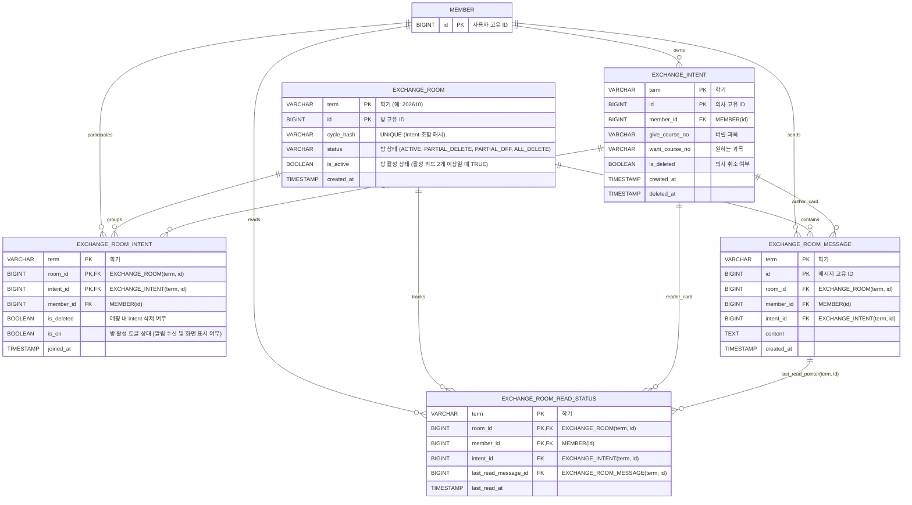

### 수강신청 과목 교환 시스템 설계 문서 (Exchange Architecture)

본 문서는 수강신청 과목 교환 매칭 도메인의 아키텍처 설계, 비동기 그래프 사이클 탐색 엔진, 파티셔닝 데이터베이스 및 성능 최적화 인덱스, Redis 캐시 제어 전략(Double Eviction), 상태 전이 및 비즈니스 플로우 상세 이정표, 그리고 API 명세를 기술합니다.

---

#### 1. 도메인의 목적과 핵심 원리

##### **[목적]**
본 시스템의 유일한 목적은 **"과목을 교환하고자 하는 사용자들의 교환 의사(Intent)를 수집하여 사이클(Cycle)을 탐색하고, 교환 가능성이 있는 사용자들을 하나의 채팅방(Room)으로 연결해 주는 것"**입니다.

##### **[주의점 1: 교환 상태 관리의 부재]**
본 시스템은 실제 수강신청 시스템과 연동되어 과목을 교환해 주는 자동화 시스템이 아닙니다. 교환의 최종 실행 여부는 사용자들이 채팅방에서 협의 후 각자 수강신청 시스템에서 직접(예: "지금 제가 취소할 테니 바로 주우세요") 진행해야 합니다.
따라서 이 도메인에는 일반적인 거래 시스템에 존재하는 **[교환 성공, 교환 실패, 교환 취소, 교환 진행 중, 교환 완료]와 같은 상태(Status) 개념이 존재하지 않습니다.** 별도의 매칭(Match) 테이블이나 상태를 기록하는 컬럼 또한 두지 않는 것이 핵심입니다.
추가적으로 방을 완전히 나가는 행동은 없으며, 유저가 개별적으로 방을 알림 수신 거부 및 목록 비노출 상태로 전환하는 **OFF(알림 수신 X, 해당 방 진입 및 UI 갱신 X) 처리** 개념만 존재합니다.

##### **[주의점 2: 과목 식별은 과목명이 아닌 '고유 학수/분반 번호(숫자)'로 진행]**
사용자는 '운영체제(OS)', '알고리즘(ALGO)'과 같은 모호한 문자열이 아닌, 실제 수강신청 책자에 명시된 **고유 번호(예: 학수번호 10023, 분반 02 등 숫자로 이루어진 식별자)**를 직접 입력하여 교환을 진행합니다. 과목명으로 매칭할 경우 교수진, 시간대, 분반이 달라 발생하는 오차를 방지하기 위함입니다. 그래프 탐색 역시 철저하게 이 숫자 식별자를 노드(Node)로 삼아 동작합니다.

##### **[핵심 원리]**
1. **Term(학기) 중심 설계:** 
   모든 데이터베이스 PK와 Redis Key는 `term`(예: `202610` - 26년도 1학기)을 기준으로 설계됩니다. `PARTITION BY LIST(term)`을 적용하여 학기별로 테이블을 물리적으로 분리하여 대용량 트래픽 상황에서도 높은 조회 성능을 보장합니다.
2. **그래프 사이클 탐색 (Graph Cycle Detection):**
   사용자의 '버릴 과목 번호 -> 원하는 과목 번호'는 방향 그래프의 간선(Directed Edge)이 됩니다. (예: `10023 -> 40101`) 시스템은 의사가 등록될 때마다 비동기로 그래프를 탐색하여 `10023 -> 40101 -> 30055 -> 10023`과 같은 닫힌 사이클(Cycle)이 발견되면 해당 간선을 생성한 사용자들을 묶어 채팅방(Room)을 생성합니다.
   - 만약 2개 이상의 사이클이 잡히면 모두 등록하여 사용자의 선택권을 보장합니다.
3. **유연한 Room 유효성 검증 (Soft Delete):**
   사용자가 교환 의사를 철회하더라도 채팅방(Room) 자체가 폭파되거나 메시지가 삭제되지 않습니다. 단지 해당 유저의 의사(Intent) 및 참여 매핑 정보가 Soft Delete(`is_deleted = true`) 처리될 뿐입니다. 채팅방의 유효성은 **(현재 활성화된 Intent 수 / 전체 Room 참여자 수)**를 바탕으로 동적으로 계산되어 UI에 노출됩니다.
4. **앱 활동성(Liveliness) 강화를 위한 실시간 피드:**
   앱이 활성화되어 있음을 유저에게 보여주기 위해, 최근 등록된 교환 의사들을 실시간 피드 형태로 노출합니다. 5초 주기의 클라이언트 폴링을 통해 효율적으로 갱신됩니다.

---

#### 2. 비동기 사이클 탐색 및 동시성 제어 아키텍처

본 시스템은 신규 Intent 생성과 무거운 연산이 필요한 그래프 탐색 프로세스를 분리하여 애플리케이션의 응답성을 보장합니다.

```mermaid
sequenceDiagram
    actor User as 사용자
    participant Controller as ExchangeController
    participant Service as ExchangeService
    participant PGMQ as Postgres Message Queue
    participant Worker as ExchangeCycleDetectionWorker
    participant Detector as ExchangeCycleDetector
    participant Creation as ExchangeRoomCreationService
    database DB as RDB (PostgreSQL)

    User->>Controller: Intent 등록 요청 (give, want)
    Controller->>Service: createIntent() 호출
    Service->>DB: EXCHANGE_INTENT 삽입
    Note over Service, DB: 트랜잭션 Commit 완료 후 비동기 처리 예약
    Service-->>PGMQ: [afterCommit] CycleDetectionMessage 발행
    Service-->>Controller: Intent 등록 응답 반환
    Controller-->>User: 응답 완료
    
    loop 1초 주기로 폴링
        Worker->>PGMQ: 메시지 수신 (Visibility Timeout 적용)
    end
    
    PGMQ-->>Worker: CycleDetectionMessage 획득
    Worker->>Detector: detectCyclesAndCreateRooms() 실행
    Detector->>DB: 활성 Intent 목록 조회 (is_deleted = FALSE)
    DB-->>Detector: active intents 목록 반환
    Note over Detector: 메모리 내 방향 그래프 구성 후 DFS 사이클 탐색
    
    alt 사이클 발견 및 신규 해시 확인
        Detector->>Creation: createRoom() 호출 (트랜잭션 시작)
        Note over Creation, DB: 사이클을 구성하는 각 Intent에 대해<br/>SELECT FOR UPDATE 비관적 락 획득
        Creation->>DB: EXCHANGE_ROOM 생성 (cycle_hash unique 제약)
        Creation->>DB: EXCHANGE_ROOM_INTENT 매핑 삽입
        Creation->>DB: EXCHANGE_ROOM_READ_STATUS 초기화
        Creation->>DB: EXCHANGE_ROOM_MESSAGE 웰컴 메시지 작성
        Note over Creation, DB: 트랜잭션 Commit 및 Redis 캐시 Evict
        Creation-->>Worker: 방 생성 성공
    end
    Worker->>PGMQ: 메시지 DELETE (처리 완료)
```

- **비동기 큐잉:** [ExchangeService](file:///home/shinnk/project/mju-sugangsincheong-helper/mju-sugangsincheong-helper-backend/src/main/java/com/mjusugangsincheonghelper/exchange/service/ExchangeService.java)는 Intent 저장 커밋이 완료된 후, PGMQ(Postgres Message Queue)를 통해 탐색 요청 메시지를 송신합니다.
- **백그라운드 스케줄링:** [ExchangeCycleDetectionWorker](file:///home/shinnk/project/mju-sugangsincheong-helper/mju-sugangsincheong-helper-backend/src/main/java/com/mjusugangsincheonghelper/exchange/service/ExchangeCycleDetectionWorker.java)는 1초 간격으로 `exchange_cycle_detection` 큐를 읽어, [ExchangeCycleDetector](file:///home/shinnk/project/mju-sugangsincheong-helper/mju-sugangsincheong-helper-backend/src/main/java/com/mjusugangsincheonghelper/exchange/service/ExchangeCycleDetector.java)를 통해 DFS 기반 탐색을 수행합니다.
- **비관적 락(Pessimistic Lock):** 
  1. [ExchangeRoomCreationService](file:///home/shinnk/project/mju-sugangsincheong-helper/mju-sugangsincheong-helper-backend/src/main/java/com/mjusugangsincheonghelper/exchange/service/ExchangeRoomCreationService.java)는 사이클에 속한 각 `ExchangeIntentEntity`를 `PESSIMISTIC_WRITE` 락으로 확보해, 탐색 시점과 방 생성 트랜잭션 커밋 사이에 유저가 Intent를 철회하여 매칭 정합성이 깨지는 것을 원천 차단합니다.
  2. 대화방 상태 갱신(`updateRoomStatusAndState`) 시점에도 `roomRepository.findByIdForUpdate(term, roomId)`를 호출하여 `ExchangeRoomEntity`에 대해 `PESSIMISTIC_WRITE` 락을 획득함으로써, 분산 환경에서 여러 사용자가 동시에 방 토글이나 이탈을 처리할 때 발생할 수 있는 갱신 분실(Lost Update) 및 경합 문제를 완전히 방지합니다.
- **방 중복 생성 방지:** 사이클을 구성하는 `intent_id`를 정렬 후 SHA-256으로 해싱한 `cycle_hash` 값을 생성하여 `EXCHANGE_ROOM` 테이블의 `UNIQUE` 제약 조건을 통해 동일 사이클로 방이 중복 생성되는 문제를 물리적으로 방지합니다.

---

#### 3. 데이터베이스 ERD & DDL 명세

##### **[ERD 다이어그램]**
상태 업데이트로 인한 Lock이나 복잡한 Join을 최소화하기 위해 철저하게 이력(History)과 기본 정보 위주로 테이블을 구성합니다. 과목 번호는 앞자리에 0이 포함될 수 있는 점을 고려하여 `varchar`로 선언하되, 내용은 숫자로 된 고유번호입니다.



##### **[DDL SQL 및 파티셔닝]**

```sql
-- 1. 회원 테이블 (전역 공통)
CREATE TABLE MEMBER (
    id BIGINT GENERATED ALWAYS AS IDENTITY,
    PRIMARY KEY (id)
);

-- 2. 교환 방 테이블 (파티션 기준 테이블)
CREATE TABLE EXCHANGE_ROOM (
    term VARCHAR(10) NOT NULL,
    id BIGINT NOT NULL,
    cycle_hash VARCHAR(64) NOT NULL,
    status VARCHAR(20) NOT NULL DEFAULT 'ACTIVE', -- 방 상태
    is_active BOOLEAN NOT NULL DEFAULT TRUE, -- 전체 방 활성 상태
    created_at TIMESTAMP NOT NULL DEFAULT NOW(),
    PRIMARY KEY (term, id),
    CONSTRAINT uniq_term_cycle_hash UNIQUE (term, cycle_hash)
) PARTITION BY LIST (term);

-- 3. 교환 의사 테이블
CREATE TABLE EXCHANGE_INTENT (
    term VARCHAR(10) NOT NULL,
    id BIGINT NOT NULL,
    member_id BIGINT NOT NULL,
    give_course_no VARCHAR(20) NOT NULL,
    want_course_no VARCHAR(20) NOT NULL,
    is_deleted BOOLEAN NOT NULL DEFAULT FALSE,
    created_at TIMESTAMP NOT NULL DEFAULT NOW(),
    deleted_at TIMESTAMP NULL,
    PRIMARY KEY (term, id),
    FOREIGN KEY (member_id) REFERENCES MEMBER(id)
) PARTITION BY LIST (term);

-- 4. 교환 방-의사 매핑 테이블
CREATE TABLE EXCHANGE_ROOM_INTENT (
    term VARCHAR(10) NOT NULL,
    room_id BIGINT NOT NULL,
    intent_id BIGINT NOT NULL,
    member_id BIGINT NOT NULL,
    is_deleted BOOLEAN NOT NULL DEFAULT FALSE, -- 의사 철회 시 비활성화 동기화용
    is_on BOOLEAN NOT NULL DEFAULT TRUE,       -- 알림 및 화면 표시 토글 상태 (유저 제어용)
    joined_at TIMESTAMP NOT NULL DEFAULT NOW(),
    PRIMARY KEY (term, room_id, intent_id),
    -- 파티션 제약을 준수하기 위해 부모 PK 복합 참조 선언
    FOREIGN KEY (term, room_id) REFERENCES EXCHANGE_ROOM(term, id),
    FOREIGN KEY (term, intent_id) REFERENCES EXCHANGE_INTENT(term, id),
    FOREIGN KEY (member_id) REFERENCES MEMBER(id)
) PARTITION BY LIST (term);

-- 5. 채팅 메시지 테이블
CREATE TABLE EXCHANGE_ROOM_MESSAGE (
    term VARCHAR(10) NOT NULL,
    id BIGINT NOT NULL,
    room_id BIGINT NOT NULL,
    member_id BIGINT NOT NULL,
    intent_id BIGINT NOT NULL,
    content TEXT NOT NULL,
    created_at TIMESTAMP NOT NULL DEFAULT NOW(),
    PRIMARY KEY (term, id),
    FOREIGN KEY (term, room_id) REFERENCES EXCHANGE_ROOM(term, id),
    FOREIGN KEY (term, intent_id) REFERENCES EXCHANGE_INTENT(term, id),
    FOREIGN KEY (member_id) REFERENCES MEMBER(id)
) PARTITION BY LIST (term);

-- 6. 안읽은 메시지 추적 테이블
CREATE TABLE EXCHANGE_ROOM_READ_STATUS (
    term VARCHAR(10) NOT NULL,
    room_id BIGINT NOT NULL,
    member_id BIGINT NOT NULL,
    intent_id BIGINT NOT NULL,
    last_read_message_id BIGINT NOT NULL,
    last_read_at TIMESTAMP NOT NULL DEFAULT NOW(),
    PRIMARY KEY (term, room_id, member_id),
    FOREIGN KEY (term, room_id) REFERENCES EXCHANGE_ROOM(term, id),
    FOREIGN KEY (term, intent_id) REFERENCES EXCHANGE_INTENT(term, id),
    FOREIGN KEY (member_id) REFERENCES MEMBER(id),
    FOREIGN KEY (term, last_read_message_id) REFERENCES EXCHANGE_ROOM_MESSAGE(term, id)
) PARTITION BY LIST (term);
```

##### **[성능 최적화 인덱스 설계]**

```sql
-----------------------------------------------------------
-- [1] EXCHANGE_INTENT 관련 인덱스
-----------------------------------------------------------

-- idx_intent_member_active: 유저 메인 화면 / 마이페이지 조회 최적화
-- 특정 member_id에 대해 삭제되지 않은(is_deleted = FALSE) 카드 목록만 추출하는 부분 인덱스(Partial Index).
-- SELECT * FROM EXCHANGE_INTENT WHERE member_id = :myId AND is_deleted = FALSE;
CREATE INDEX idx_intent_member_active 
    ON EXCHANGE_INTENT(member_id) 
    WHERE is_deleted = FALSE;

-- idx_intent_matching_pool: 매칭 엔진(그래프 사이클 탐색) 스캔 최적화
-- 아직 유효한(is_deleted = FALSE) 교환 의사의 과목 매핑 정보를 인덱스 풀로 빠르게 확보.
-- SELECT * FROM EXCHANGE_INTENT WHERE give_course_no = :give AND want_course_no = :want AND is_deleted = FALSE;
CREATE INDEX idx_intent_matching_pool 
    ON EXCHANGE_INTENT(give_course_no, want_course_no) 
    WHERE is_deleted = FALSE;


-----------------------------------------------------------
-- [2] EXCHANGE_ROOM_INTENT 관련 인덱스
-----------------------------------------------------------

-- idx_room_intent_member: 유저의 활성 대화방 리스트 폴링 최적화
-- 사용자가 앱에 진입하거나 5초 주기로 메인 화면을 폴링할 때 '참여 중이고 활성화(is_on = TRUE)된 방'의 ID를 빠르게 획득.
-- SELECT room_id FROM EXCHANGE_ROOM_INTENT WHERE member_id = :myId AND is_on = TRUE;
CREATE INDEX idx_room_intent_member 
    ON EXCHANGE_ROOM_INTENT(member_id, room_id)
    WHERE is_on = TRUE;

-- idx_room_intent_reverse: 특정 카드 취소 시 연관 대화방 역방향 추적 최적화
-- 유저가 의사를 삭제(취소)했을 때 해당 카드가 연결되어 활성화 중이던 방 목록을 역방향으로 조회해 방 비활성화 또는 시스템 알림 전송.
-- SELECT room_id FROM EXCHANGE_ROOM_INTENT WHERE intent_id = :deletedIntentId;
CREATE INDEX idx_room_intent_reverse 
    ON EXCHANGE_ROOM_INTENT(intent_id, room_id);


-----------------------------------------------------------
-- [3] EXCHANGE_ROOM_MESSAGE 관련 인덱스
-----------------------------------------------------------

-- idx_message_room_id_pagination: 대화방 내부 페이징 및 폴링 최적화
-- 특정 방의 메시지를 최신순(id DESC)으로 조회하거나 마지막 확인 메시지 ID 이후의 새로운 메시지만 가져오는 실시간 채팅의 핵심 인덱스.
-- SELECT * FROM EXCHANGE_ROOM_MESSAGE WHERE room_id = :roomId AND id > :lastViewedId ORDER BY id DESC;
CREATE INDEX idx_message_room_id_pagination 
    ON EXCHANGE_ROOM_MESSAGE(room_id, id DESC);


-----------------------------------------------------------
-- [4] EXCHANGE_ROOM_READ_STATUS 관련 인덱스
-----------------------------------------------------------

-- idx_read_status_member: 채팅 탭의 '안 읽은 메시지 수(빨간 배지)' 계산 오버헤드 최소화
-- 메인화면/목록 조회 시 내가 참여하는 각 방의 "마지막 읽음 메시지 위치"를 한 번에 조회하여 안 읽은 메시지 수를 신속히 집계.
-- SELECT room_id, last_read_message_id FROM EXCHANGE_ROOM_READ_STATUS WHERE member_id = :myId;
CREATE INDEX idx_read_status_member 
    ON EXCHANGE_ROOM_READ_STATUS(member_id, room_id);
```

##### **[동적 학기별 파티션 테이블 생성 스크립트]**

```sql
DO $$
DECLARE
    start_year INT := 2026;
    end_year INT := 2100;
    current_year INT;
    terms TEXT[] := ARRAY['10', '15', '20', '25']; -- 10: 1학기, 15: 여름학기, 20: 2학기, 25: 겨울학기
    t TEXT;
    target_term TEXT;
BEGIN
    FOR current_year IN start_year..end_year LOOP
        FOREACH t IN ARRAY terms LOOP
            target_term := current_year::TEXT || t;
            
            EXECUTE format('CREATE TABLE IF NOT EXISTS exchange_room_%I PARTITION OF exchange_room FOR VALUES IN (%L)', target_term, target_term);
            EXECUTE format('CREATE TABLE IF NOT EXISTS exchange_intent_%I PARTITION OF exchange_intent FOR VALUES IN (%L)', target_term, target_term);
            EXECUTE format('CREATE TABLE IF NOT EXISTS exchange_room_intent_%I PARTITION OF exchange_room_intent FOR VALUES IN (%L)', target_term, target_term);
            EXECUTE format('CREATE TABLE IF NOT EXISTS exchange_room_message_%I PARTITION OF exchange_room_message FOR VALUES IN (%L)', target_term, target_term);
            EXECUTE format('CREATE TABLE IF NOT EXISTS exchange_room_read_status_%I PARTITION OF exchange_room_read_status FOR VALUES IN (%L)', target_term, target_term);
            
        END LOOP;
    END LOOP;
END $$;
```

---

#### 4. Redis 캐시 전략 및 정합성 보장

본 시스템은 분산 서버 환경에서의 빠른 실시간 5초 폴링을 지원하기 위해, **RDB를 단일 신뢰 원천(Single Source of Truth)으로 삼고, Redis 캐시를 조작하여 캐시 정합성을 유지**하는 방식으로 설계되었습니다.

##### **[Redis 캐시 키 정의]**

| 캐시 종류 | Redis Key 형식 | 데이터 구조 | TTL | 설명 |
| :--- | :--- | :--- | :--- | :--- |
| **CACHE 1** (공용 피드) | `exchange::{term}:feed:cache` | List | 10분 | 실시간 전체 공용 피드로 사용되는 최근 50개의 교환 의사 DTO 리스트. |
| **CACHE 2** (유저별 Intent) | `exchange::{term}:member:{member_id}:intents:cache` | List | 10분 | 해당 유저가 등록한 미삭제 상태의 활성 Intent DTO 리스트. |
| **CACHE 3** (유저별 방 목록) | `exchange::{term}:member:{member_id}:rooms:cache` | List | 10분 | 해당 유저가 참여 중이고 화면 표시가 켜진(is_on = TRUE) 방의 요약 정보 목록 (안 읽은 개수, 최신 글 포함). |

- 모든 캐시 객체의 날짜/시간 필드는 직렬화 일관성을 위해 ISO-8601 문자열 대신 **밀리초 단위 epoch timestamp (Long)** 형식으로 직렬화합니다.

##### **[정합성 보장: 이중 무효화 (Double Eviction) 전략]**

RDB 트랜잭션 도중 예외가 발생할 경우 캐시만 일방적으로 오염되는 문제를 막기 위해, 모든 캐시 무효화는 `TransactionSynchronizationManager.registerSynchronization`을 통해 **RDB 트랜잭션이 성공적으로 COMMIT된 후(afterCommit)에 비동기로 실행**됩니다. 

또한, 데이터 커밋 시점과 WAS 조회 시점 사이의 분산 환경 레이스 컨디션을 방지하기 위해 **Double Eviction(이중 무효화)** 기법을 적용합니다:
1. 트랜잭션 커밋 완료 직후 `redisTemplate.delete(key)`를 즉시 1차 수행합니다.
2. `TaskScheduler`를 활용하여 2초의 딜레이(`DOUBLE_EVICT_DELAY`) 이후 해당 키에 대한 `delete(key)`를 한 번 더 비동기로 수행하여 찰나의 순간에 복구된 정합성 어긋난 캐시 데이터를 완전히 무효화합니다.

```java
// [ExchangeCacheService.java] 이중 무효화 메커니즘 일부
private void scheduleDoubleEvict(String key) {
    taskScheduler.schedule(() -> {
        try {
            redisTemplate.delete(key);
        } catch (Exception e) {
            log.warn("Double evict failed for key={}: {}", key, e.getMessage());
        }
    }, java.time.Instant.now().plus(Duration.ofSeconds(2)));
}
```

##### **[캐시 미스 시 자동 복구 로직]**

캐시 미스(Cache Miss) 발생 시 WAS는 RDB를 직접 질의하여 최신 정합성 데이터를 가져오고, Redis에 데이터를 재적재하여 성능을 최적화합니다.

- **CACHE 1 복구 쿼리:**
  ```sql
  SELECT * FROM EXCHANGE_INTENT 
  WHERE term = :term AND is_deleted = FALSE 
  ORDER BY id DESC LIMIT 50;
  ```
- **CACHE 2 복구 쿼리:**
  ```sql
  SELECT * FROM EXCHANGE_INTENT 
  WHERE term = :term AND member_id = :member_id AND is_deleted = FALSE 
  ORDER BY id DESC;
  ```
- **CACHE 3 복구 쿼리:**
  ```sql
  SELECT
      r.id                          AS room_id,
      r.is_active,
      msg.content                   AS last_message_content,
      msg.created_at                AS last_message_at,
      COUNT(new_msg.id)             AS unread_count
  FROM EXCHANGE_ROOM_INTENT ri
  JOIN EXCHANGE_ROOM r
      ON r.term = ri.term AND r.id = ri.room_id
  LEFT JOIN EXCHANGE_ROOM_MESSAGE msg
      ON msg.term = ri.term AND msg.id = (
          SELECT id FROM EXCHANGE_ROOM_MESSAGE
          WHERE term = ri.term AND room_id = ri.room_id
          ORDER BY id DESC LIMIT 1
      )
  LEFT JOIN EXCHANGE_ROOM_READ_STATUS rs
      ON rs.term = ri.term AND rs.room_id = ri.room_id AND rs.member_id = :member_id
  LEFT JOIN EXCHANGE_ROOM_MESSAGE new_msg
      ON new_msg.term = ri.term
      AND new_msg.room_id = ri.room_id
      AND new_msg.id > COALESCE(rs.last_read_message_id, 0)
  WHERE ri.term      = :term
    AND ri.member_id = :member_id
    AND ri.is_on     = TRUE
    AND ri.is_deleted = FALSE
  GROUP BY r.id, r.is_active, msg.content, msg.created_at;
  ```

---

#### 5. 상태 및 비즈니스 플로우 상세 이정표

---

- **① INTENT 등록**
    - **트리거:** 사용자가 버릴 과목과 원하는 과목 번호를 입력하여 카드를 등록할 때.
    - **타겟 테이블:** `EXCHANGE_INTENT`
    - **상세 처리 로직:**
        1. 동일 학기에 중복된 활성 의사(`is_deleted = FALSE`)가 존재하는지 확인 후, 새 레코드를 생성합니다 (`is_deleted = FALSE`).
        2. 트랜잭션이 완결되면 `afterCommit` 훅을 통해 PGMQ 비동기 큐에 이벤트를 전송하고 **[② 사이클 탐색]**을 스케줄링합니다.
    - **캐시 조작:**
        1. `exchange::{term}:feed:cache`: 새 Intent DTO를 `LPUSH` 후 `LTRIM`으로 최대 50개 유지하고 만료시간 갱신.
        2. `exchange::{term}:member:{member_id}:intents:cache`: 이중 무효화(`evictIntents`) 실행.

---

- **② 사이클 탐색**
    - **트리거:** PGMQ로부터 `CycleDetectionMessage` 이벤트를 수신했을 때.
    - **타겟 테이블:** `EXCHANGE_INTENT` (Read Only)
    - **상세 처리 로직:**
        1. `idx_intent_matching_pool` 인덱스를 이용해 현재 학기 내의 모든 활성 의사 목록(`is_deleted = FALSE`)을 스캔합니다.
        2. 과목 식별자 쌍(`give_course_no` -> `want_course_no`)을 방향 그래프의 간선으로 메모리에 구축한 후 DFS 알고리즘을 사용해 순환 고리(Cycle)를 탐색합니다.
        3. 발견된 사이클의 `intent_id` 목록을 정렬한 뒤 SHA-256으로 해싱하여 고유 `cycle_hash`를 추출합니다.
        4. 동일한 `cycle_hash`를 가진 `EXCHANGE_ROOM`이 존재하지 않을 때에만 **[③ 방 생성 및 초기화]**를 개시합니다.
    - **캐시 조작:** 없음.

---

- **③ 방 생성 및 초기화**
    - **트리거:** 신규 사이클 발견 및 고유 `cycle_hash` 검증 완료 시.
    - **타겟 테이블:** `EXCHANGE_ROOM`, `EXCHANGE_ROOM_INTENT`, `EXCHANGE_ROOM_READ_STATUS`, `EXCHANGE_ROOM_MESSAGE`
    - **상세 처리 로직 (단일 트랜잭션):**
        1. **비관적 락 획득:** 사이클 내의 `intent_id` 레코드들을 `SELECT FOR UPDATE`로 락을 걸고 삭제 여부를 재검증합니다.
        2. **방 생성:** `EXCHANGE_ROOM` 테이블에 신규 행을 저장합니다 (`cycle_hash` 포함).
        3. **참여자 매핑:** `EXCHANGE_ROOM_INTENT` 테이블에 모든 참여자의 정보를 적재합니다 (`is_deleted = FALSE`, `is_on = TRUE`).
        4. **읽음 포인터 초기화:** `EXCHANGE_ROOM_READ_STATUS` 테이블에 참여자별 초기 읽음 상태를 저장합니다.
        5. **시스템 메시지 전송:** 매칭 완료 안내 텍스트를 `EXCHANGE_ROOM_MESSAGE`에 삽입하고, 이 메시지의 고유 ID로 각 참여자의 `last_read_message_id`를 최신화하여 읽음 처리합니다.
    - **캐시 조작:**
        1. 방 참여자 **전원**의 `exchange::{term}:member:{member_id}:rooms:cache`에 대해 이중 무효화(`evictRooms`) 처리합니다.

---

- **④ INTENT 삭제**
    - **트리거:** 유저가 메인 화면이나 마이페이지에서 자신이 등록한 카드를 삭제(철회)할 때.
    - **타겟 테이블:** `EXCHANGE_INTENT`, `EXCHANGE_ROOM_INTENT`, `EXCHANGE_ROOM`, `EXCHANGE_ROOM_MESSAGE`
    - **상세 처리 로직 (단일 트랜잭션):**
        1. **의사 삭제:** `EXCHANGE_INTENT` 테이블에서 대상 카드를 `is_deleted = TRUE` 및 `deleted_at = NOW()`로 갱신합니다.
        2. **영향 받는 대화방 파악:** 역방향 인덱스(`idx_room_intent_reverse`)를 통해 해당 카드가 참여 중이던 대화방 목록을 조회합니다.
        3. **매핑 동기화:** 식별된 대화방들의 해당 멤버 매핑 정보(`EXCHANGE_ROOM_INTENT`) 내 상태를 `is_deleted = TRUE`, `is_on = FALSE`로 갱신합니다.
        4. **방 활성 상태 재계산:**
           - 해당 방의 전체 참여자 수($N$)와 의사가 삭제된 이탈자 수($D$)를 집계합니다.
           - 잔여 인원($N-D$)이 **2명 미만**이 되는 경우 해당 방을 비활성화합니다 (`EXCHANGE_ROOM.is_active = FALSE`).
        5. **알림 메시지 생성:** 대화방에 사용자의 이탈 알림 및 전체 방 비활성화 알림 시스템 메시지를 작성하여 삽입합니다.
    - **캐시 조작:**
        1. 탈퇴자 본인의 `exchange::{term}:member:{member_id}:intents:cache` 이중 무효화.
        2. 연관된 방에 속해 있는 **참여자 전원**의 `exchange::{term}:member:{member_id}:rooms:cache` 이중 무효화.

---

- **⑤ 방 ON/OFF 토글**
    - **트리거:** 사용자가 특정 대화방 목록에서 알림 수신을 일시정지하거나 방을 목록에서 숨기기 위해 토글 스위치를 켰다 껄 때.
    - **타겟 테이블:** `EXCHANGE_ROOM_INTENT`, `EXCHANGE_ROOM`
    - **상세 처리 로직 (단일 트랜잭션):**
        1. 해당 유저의 `EXCHANGE_ROOM_INTENT` 테이블 내 `is_on` 컬럼을 입력받은 값(`TRUE` or `FALSE`)으로 업데이트합니다.
        2. `updateRoomStatusAndState`를 호출하여 `PESSIMISTIC_WRITE` 락을 걸고 방 상태를 재계산(상태 전이 규칙 A, B, C, D 적용)한 뒤 `EXCHANGE_ROOM` 테이블의 `status` 및 `is_active`를 업데이트합니다.
        3. 토글이 `FALSE`가 된 유저의 경우 메인/채팅방 목록 쿼리에서 `idx_room_intent_member` 인덱스의 필터 조건(`is_on = TRUE`)에 의해 즉시 조회 결과에서 배제됩니다.
    - **캐시 조작:**
        1. 토글을 조작한 유저 **본인**의 `exchange::{term}:member:{member_id}:rooms:cache` 이중 무효화.

---

- **⑥ MESSAGE 전송**
    - **트리거:** 사용자가 활성화된 대화방 내부에서 텍스트를 작성하여 전송할 때.
    - **타겟 테이블:** `EXCHANGE_ROOM_MESSAGE`, `EXCHANGE_ROOM_READ_STATUS`
    - **상세 처리 로직 (단일 트랜잭션):**
        1. `EXCHANGE_ROOM_MESSAGE` 테이블에 해당 학기, 방 ID, 발신자 고유 ID와 Intent ID, 그리고 본문 텍스트를 저장합니다.
        2. 발신자 본인은 메시지를 전송하자마자 읽은 것이 되므로, 생성된 메시지 ID로 본인의 `EXCHANGE_ROOM_READ_STATUS.last_read_message_id`를 즉시 갱신합니다.
    - **캐시 조작:**
        1. 대화방에 속한 **참여자 전원**의 `exchange::{term}:member:{member_id}:rooms:cache` 이중 무효화 (안 읽은 개수 및 최근 글 갱신 목적).

---

- **⑦ MESSAGE 읽음**
    - **트리거:** 사용자가 대화방 내부에 접속하거나, 대화방을 켜둔 채로 5초 폴링을 통해 신규 메시지를 확인했을 때.
    - **타겟 테이블:** `EXCHANGE_ROOM_READ_STATUS`
    - **상세 처리 로직:**
        1. 해당 방의 가장 큰 메시지 ID를 조회한 뒤, `EXCHANGE_ROOM_READ_STATUS` 테이블 내 본인 레코드의 `last_read_message_id` 필드를 해당 ID로 업데이트합니다.
    - **캐시 조작:**
        1. 본인의 `exchange::{term}:member:{member_id}:rooms:cache` 이중 무효화 (안 읽은 메시지 수 `0` 갱신 목적).

---

#### 6. API 명세 (API Specifications)

##### **[공통 응답 구조]**
성공 시 모든 응답은 `SingleSuccessResponseEnvelope` 표준 규격으로 감싸져 반환됩니다. `meta` 필드는 글로벌 필터에 의해 공통 주입됩니다.

```json
{
  "data": { ... },
  "meta": {
    "requestId": "req-77821",
    "apiVersion": "v1",
    "path": "/api/v1/exchange/...",
    "method": "GET | POST | DELETE | PATCH",
    "timestamp": 1749518850000,
    "durationMs": 45,
    "ipAddress": "127.0.0.1",
    "userAgent": "Mozilla/5.0..."
  }
}
```

> 가독성을 위해 아래 개별 명세에서는 `data` 객체의 필드 위주로 기술합니다.

---

##### **1. 교환 의사(Intent) 등록**
- **Method & Path:** `POST /api/v1/exchange/intents`
- **Description:** 버릴 과목과 원하는 과목 번호를 지정하여 매칭 풀에 등록합니다.
- **Request Body:**
  ```json
  {
    "giveCourseNo": "10023",
    "wantCourseNo": "40101"
  }
  ```
- **Response JSON (201 Created):**
  ```json
  {
    "data": {
      "intentId": 10524,
      "memberId": 9931,
      "giveCourseNo": "10023",
      "wantCourseNo": "40101",
      "isDeleted": false,
      "createdAt": 1749518850000
    }
  }
  ```

---

##### **2. 교환 의사(Intent) 철회**
- **Method & Path:** `DELETE /api/v1/exchange/intents/{intentId}`
- **Description:** 등록했던 카드를 철회합니다. 연관 대화방의 인원이 부족할 경우 방은 자동으로 비활성화됩니다.
- **Response JSON (200 OK):**
  ```json
  {
    "data": {
      "intentId": 10524,
      "isDeleted": true,
      "deletedAt": 1749519312000
    }
  }
  ```

---

##### **3. 메인 화면 상태 조회 (5초 주기 Polling 용도)**
- **Method & Path:** `GET /api/v1/exchange/main`
- **Description:** 5초 주기로 메인 화면을 갱신하는 통합 조회 API입니다. Redis 내 분산 마이크로 캐시를 조립하여 반환함으로써 RDB의 조회 병목을 최소화합니다.
- **Response JSON (200 OK):**
  ```json
  {
    "data": {
      "myIntents": [
        {
          "intentId": 10524,
          "giveCourseNo": "10023",
          "wantCourseNo": "40101",
          "isDeleted": false,
          "createdAt": 1749518850000
        }
      ],
      "myRooms": [
        {
          "roomId": 402,
          "isActive": true,
          "isOn": true,
          "unreadCount": 2,
          "lastMessageContent": "네 그럼 3시에 맞춰서 동시에 취소할까요?",
          "lastMessageAt": 1749519015000
        }
      ],
      "recentIntents": [
        { "intentId": 10529, "giveCourseNo": "50201", "wantCourseNo": "10042", "createdAt": 1749519730000 },
        { "intentId": 10528, "giveCourseNo": "30122", "wantCourseNo": "20441", "createdAt": 1749519712000 },
        { "intentId": 10527, "giveCourseNo": "11025", "wantCourseNo": "30221", "createdAt": 1749519644000 },
        { "intentId": 10526, "giveCourseNo": "40012", "wantCourseNo": "99301", "createdAt": 1749519601000 },
        { "intentId": 10525, "giveCourseNo": "20391", "wantCourseNo": "10023", "createdAt": 1749519520000 }
      ]
    }
  }
  ```

---

##### **4. 최근 등록된 교환 의사 피드 조회 (무한 스크롤)**
- **Method & Path:** `GET /api/v1/exchange/intents/recent?lastIntentId={lastIntentId}&limit={limit}`
- **Description:** 피드 캐시를 기반으로 커서 페이징을 수행해 최신 Intent 리스트를 무한 스크롤로 반환합니다.
- **Query Parameters:**
  | 파라미터 | 타입 | 필수 여부 | 설명 |
  | :--- | :--- | :--- | :--- |
  | `lastIntentId` | Long | N | 직전 페이지의 마지막 `intentId`. 미지정 시 최신 목록부터 반환. |
  | `limit` | Integer | N | 조회할 개수. 기본값 10, 최대 50. |

- **Response JSON (200 OK):**
  ```json
  {
    "data": {
      "intents": [
        { "intentId": 10524, "giveCourseNo": "10023", "wantCourseNo": "40101", "createdAt": 1749518850000 },
        { "intentId": 10523, "giveCourseNo": "20011", "wantCourseNo": "50022", "createdAt": 1749518848000 }
      ],
      "nextLastIntentId": 10523,
      "hasNext": false
    }
  }
  ```

---

##### **5. 채팅방 메시지 내역 조회**
- **Method & Path:** `GET /api/v1/exchange/rooms/{roomId}/messages?lastMessageId={lastMessageId}&size={size}`
- **Description:** 해당 방의 이전 메시지 이력을 페이징하여 조회합니다. 호출 시 자동으로 읽음 처리 스키마(`EXCHANGE_ROOM_READ_STATUS`)가 갱신됩니다.
- **Query Parameters:**
  | 파라미터 | 타입 | 필수 여부 | 설명 |
  | :--- | :--- | :--- | :--- |
  | `lastMessageId` | Long | N | 직전 페이지의 마지막 메시지 ID. 미지정 시 가장 최신부터 반환. |
  | `size` | Integer | N | 한 번에 가져올 메시지 수. 기본값 20. |

- **Response JSON (200 OK):**
  ```json
  {
    "data": {
      "roomId": 402,
      "messages": [
        { "messageId": 55102, "senderId": 4412, "content": "네 그럼 3시에 맞춰서 동시에 취소할까요?", "createdAt": 1749519015000 },
        { "messageId": 55101, "senderId": 9931, "content": "저는 10023 과목 버립니다.", "createdAt": 1749518940000 }
      ],
      "nextLastMessageId": 55101,
      "hasNext": true
    }
  }
  ```

---

##### **6. 채팅방 메시지 전송**
- **Method & Path:** `POST /api/v1/exchange/rooms/{roomId}/messages`
- **Description:** 해당 방의 참여자에게 메시지를 전송하고 발신자 본인은 즉시 읽음 처리합니다.
- **Request Body:**
  ```json
  {
    "content": "좋습니다. 대기하겠습니다."
  }
  ```
- **Response JSON (201 Created):**
  ```json
  {
    "data": {
      "messageId": 55103,
      "roomId": 402,
      "senderId": 9931,
      "content": "좋습니다. 대기하겠습니다.",
      "createdAt": 1749520580000
    }
  }
  ```

---

##### **7. 방 ON/OFF 토글**
- **Method & Path:** `PATCH /api/v1/exchange/rooms/{roomId}/toggle`
- **Description:** 특정 방의 알림 수신 상태 및 메인 목록 노출 여부를 전환합니다. `isOn: false`로 설정된 방은 메인 화면 폴링 목록에서 배제됩니다.
- **Request Body:**
  ```json
  {
    "isOn": false
  }
  ```
- **Response JSON (200 OK):**
  ```json
  {
    "data": {
      "roomId": 402,
      "isOn": false
    }
  }
  ```