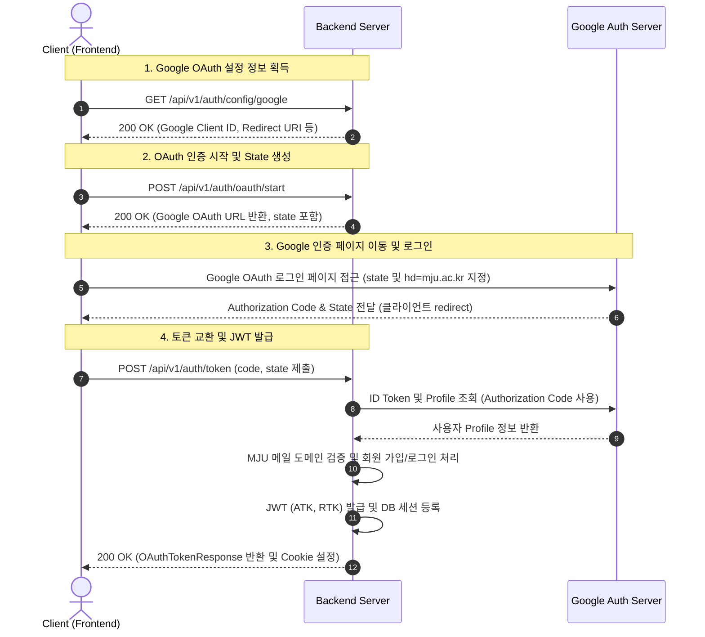
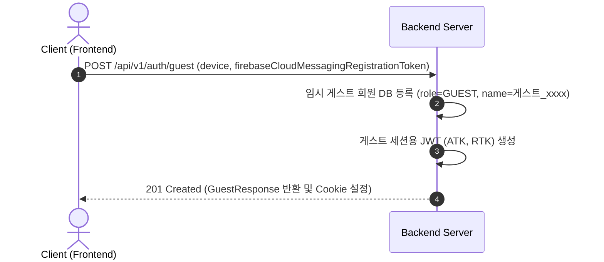
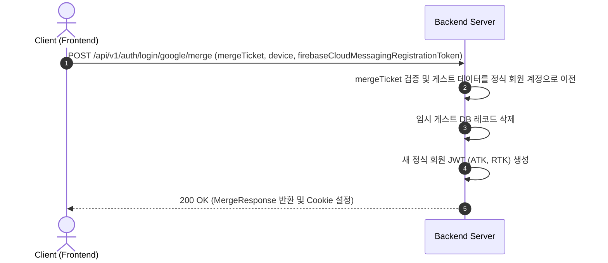
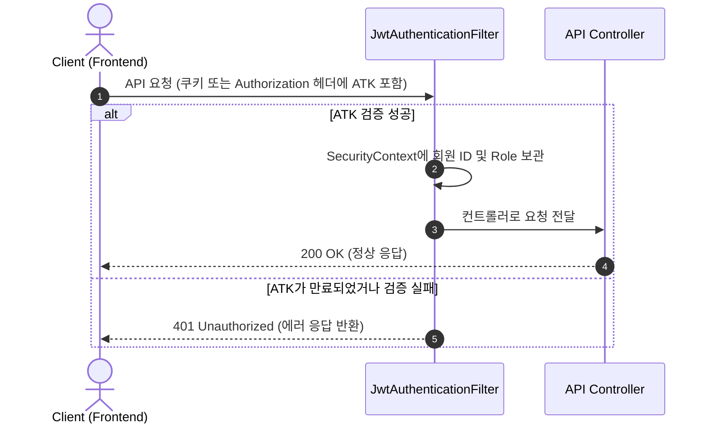
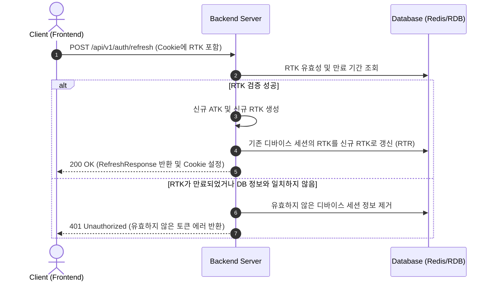
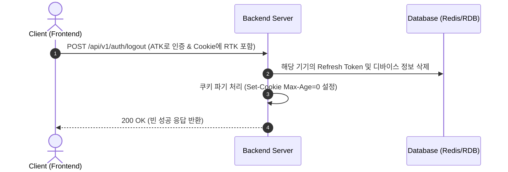

# Login Logic Architecture (인증 및 로그인 흐름)

본 문서는 명지대 수강신청 도우미 서비스의 인증 정책과 로그인, 세션 갱신, 게스트 병합, 로그아웃 등 전체 인증 라이프사이클 흐름을 정의합니다.

---

## 1. 인증 개요

### 1.1 사용자 신분 (Role)

| 신분 (Role) | 식별 수단 | 설명 |
| :--- | :--- | :--- |
| **GUEST** | ATK / RTK (Cookie) | 임시 계정으로, 약관 동의 절차 등을 처리하기 위해 발급되는 상태 |
| **MEMBER** | ATK / RTK (Cookie) | 명지대 Google 계정으로 로그인이 완료된 정식 재학생 / 교직원 상태 |
| **ADMIN** | ATK / RTK (Cookie) | 시스템 및 설정 관리 권한을 가진 운영자 상태 |

### 1.2 토큰 및 쿠키 정책

토큰은 기본적으로 **HttpOnly Cookie**를 기반으로 전송됩니다. 
개발 및 테스트 편의성을 위해 **dev**와 **test** 환경(`app.auth.token-in-response: true`)에서는 응답 바디(JSON)에도 토큰이 포함되어 전송되지만, 운영(**prod**) 환경(`app.auth.token-in-response: false`)에서는 응답 바디에 토큰이 포함되지 않으며 **오직 HttpOnly Cookie로만 전송**됩니다.

*   **Access Token (ATK)**: API 인증용 임시 토큰 (만료 1시간, HttpOnly Cookie `access_token`)
*   **Refresh Token (RTK)**: 세션 연장용 토큰 (만료 7일, HttpOnly Cookie `refresh_token` + DB 매칭)
*   **쿠키 속성**: `HttpOnly = true`, `Secure = true`, `SameSite = Lax`, `Path = /`

---

## 2. Google OAuth2 로그인 흐름

프론트엔드가 Google 인증 흐름을 제어하며, 백엔드로부터 인증 URL을 발급받아 로그인을 진행한 뒤, 획득한 `code`와 `state`를 백엔드에 제출하여 최종 JWT(ATK/RTK) 세션을 획득하는 구조입니다.

### 2.1 시퀀스 다이어그램

### 2.2 각 요청 명세

#### ① Google Config 조회
*   **보내는 측**: Client $\rightarrow$ Backend Server
*   **목적**: Google 로그인에 필요한 구글 클라이언트 ID와 리다이렉트 주소를 조회하기 위함.
*   **요청 값**: 없음 (GET)
*   **응답 값**:
    *   `data.clientId`: Google Client ID
    *   `data.redirectUri`: 인증 후 구글이 리다이렉트할 주소
    *   `data.scopes`: 요청할 스코프 리스트 (`openid`, `profile`, `email`)

#### ② OAuth 시작 URL 획득
*   **보내는 측**: Client $\rightarrow$ Backend Server
*   **목적**: 검증용 `state`를 백엔드에 안전하게 발급받고, 구글 로그인 화면으로 이동할 최종 조립 URL을 생성하기 위함.
*   **요청 값**: 없음 (POST)
*   **응답 값**:
    *   `data.googleAuthUrl`: Google 인증 페이지 URL (state 및 `hd=mju.ac.kr` 도메인 제약 파라미터가 포함되어 있음)

#### ③ Google 인증 요청
*   **보내는 측**: Client $\rightarrow$ Google Auth Server
*   **목적**: 명지대 Google 계정 인증 및 약관 동의를 통해 일회성 인증 코드를 획득하기 위함.
*   **요청 값**: `data.googleAuthUrl` 로 리다이렉트
*   **응답 값**: Client의 `redirectUri`로 리다이렉트되며, 쿼리 파라미터로 `code` (Authorization Code)와 `state`가 반환됨.

#### ④ 토큰 교환 및 JWT 발급
*   **보내는 측**: Client $\rightarrow$ Backend Server
*   **목적**: 획득한 Authorization Code를 백엔드에 제출하여 최종적으로 서비스 이용을 위한 JWT 토큰 세션을 발급받기 위함.
*   **요청 값**:
    *   Payload: `{ "code": "구글인증코드", "state": "인증시작시받았던State" }`
*   **응답 값**:
    *   **Set-Cookie**:
        *   `access_token=JWT_ACCESS_TOKEN; HttpOnly; Secure; SameSite=Lax; Path=/`
        *   `refresh_token=JWT_REFRESH_TOKEN; HttpOnly; Secure; SameSite=Lax; Path=/`
    *   **Payload (`OAuthTokenResponse`)**:
        *   `data.status`: `"SUCCESS"`
        *   `data.newUser`: 신규 회원 여부 (`true` / `false`)
        *   `data.memberId`: 회원 식별 ID
        *   `data.role`: 회원 권한 (`MEMBER`, `ADMIN`)
        *   `data.name`: 파싱된 한글 이름
        *   `data.position`: 직위 (예: 학생, 교수 등)
        *   `data.department`: 소속 학과

---

## 3. 게스트 로그인 흐름

회원가입 이전에 개인정보 동의 약관 확인 등 임시 식별자가 필요할 때 생성하는 게스트 세션 발급 흐름입니다.

### 3.1 시퀀스 다이어그램

### 3.2 각 요청 명세

#### ① 게스트 계정 생성
*   **보내는 측**: Client $\rightarrow$ Backend Server
*   **목적**: 로그인하지 않은 유저가 임시로 API를 호출하고 고유 식별자를 발급받아 동의 내역 등을 기록하기 위함.
*   **요청 값**:
    *   Payload (선택): `{ "firebaseCloudMessagingRegistrationToken": "FCM토큰값", "device": { "osType": "ANDROID", "deviceModel": "..." } }`
*   **응답 값**:
    *   **Set-Cookie**: `access_token` 및 `refresh_token` 쿠키
    *   **Payload (`GuestResponse`)**:
        *   `data.memberId`: 생성된 게스트 임시 ID
        *   `data.role`: `"GUEST"`
        *   `data.name`: 임시 게스트 이름 (`"게스트_xxxx"`)

---

## 4. 게스트 $\rightarrow$ 회원 데이터 병합 흐름 (Merge)

임시 게스트 상태로 이용하던 기기 설정이나 동의 내역 등을 정식 명지대 구글 계정에 병합하는 흐름입니다.

### 4.1 시퀀스 다이어그램

### 4.2 각 요청 명세

#### ① 데이터 병합 요청
*   **보내는 측**: Client $\rightarrow$ Backend Server
*   **목적**: 게스트 계정에서 저장되었던 디바이스 정보, 약관 동의 내역 등의 데이터를 신규 연동된 정식 회원 데이터로 통합하기 위함.
*   **요청 값**:
    *   Payload: `{ "mergeTicket": "티켓토큰값", "firebaseCloudMessagingRegistrationToken": "FCM토큰값", "device": { ... } }`
*   **응답 값**:
    *   **Set-Cookie**: 갱신된 정식 회원용 `access_token` 및 `refresh_token` 쿠키
    *   **Payload (`MergeResponse`)**:
        *   `data.memberId`: 병합이 완료된 정식 회원 ID
        *   `data.role`: `"MEMBER"`
        *   `data.name`: 회원 이름
        *   `data.position`: 직위
        *   `data.department`: 학과

---

## 5. 이후 요청 흐름 (인증 및 세션 유지)

### 5.1 요청 인증 흐름 (Filter)

모든 인증이 필요한 API 요청 시 토큰의 유효성을 필터 수준에서 확인하는 공통 흐름입니다.

*   **보내는 측**: Client $\rightarrow$ Backend (JwtAuthenticationFilter)
*   **목적**: 매 요청마다 사용자가 적절한 자격을 가지고 있는지 신속하게 검증하고 권한을 체크하기 위함.
*   **요청 값**:
    *   운영 환경 (prod): `Cookie` 내의 `access_token`
    *   개발 환경 (dev): `Authorization: Bearer <token>` 헤더 혹은 `Cookie` 내의 `access_token`
*   **응답 값**:
    *   정상: 본래 요청한 API의 결과 데이터 반환
    *   만료/유효하지 않음: `401 Unauthorized` 예외 응답 (`GLOBAL_SECURITY_001`)

### 5.2 토큰 재발급 흐름 (Refresh)

Access Token이 만료되어 API 요청이 차단된 경우, 저장된 Refresh Token을 사용해 세션을 안전하게 갱신하는 흐름입니다. **RTR(Refresh Token Rotation)** 방식이 적용되어 연장 시 Refresh Token도 무조건 새로 갱신됩니다.

*   **보내는 측**: Client $\rightarrow$ Backend Server
*   **목적**: Access Token 만료 시, 로그인 세션을 끊지 않고 안전하게 연장(재발급)하기 위함.
*   **요청 값**:
    *   **Cookie**: `refresh_token=기존RTK값`
*   **응답 값**:
    *   **Set-Cookie**:
        *   `access_token=새로운ATK; HttpOnly; ...`
        *   `refresh_token=새로운RTK; HttpOnly; ...`
    *   **Payload (`RefreshResponse`)**:
        *   `data.status`: `"success"`
        *   `data.role`: 회원 권한

### 5.3 로그아웃 흐름 (Logout)

사용자의 명시적인 요청에 의해 세션을 완전 종료하고, 저장된 세션 및 토큰을 무효화하는 흐름입니다.

*   **보내는 측**: Client $\rightarrow$ Backend Server
*   **목적**: 사용자의 활성 세션을 즉시 종료하고 기기에 발행된 보안 토큰 정보를 지우기 위함.
*   **요청 값**:
    *   **Cookie**: `refresh_token` 및 `access_token`
    *   Payload (선택): `{ "firebaseCloudMessagingRegistrationToken": "FCM토큰값" }` (로그아웃 시 모바일 푸시 발송을 차단하기 위함)
*   **응답 값**:
    *   **Set-Cookie**: `access_token=; Max-Age=0`, `refresh_token=; Max-Age=0` (쿠키 즉시 만료)
    *   **Payload**: 빈 성공 응답 (`SingleSuccessResponseEnvelope.empty()`)
