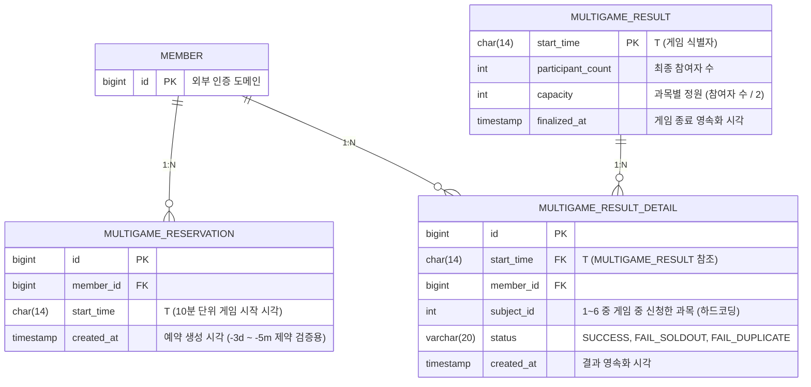

## Layer 0: 시스템 3단계 분리 (예약, 게임중, 결과)

본 시스템은 **예약, 게임, 결과** 완전히 분리되어 동작합니다. 
여기서 예약, 결과는 db 만 조회합니다 즉 게임중 사용하는 **식별자 T(게임 시작 시각)와 상태(State Machine)는 오직 '게임중' 단계에만 종속**됩니다. 예약 단계와 결과 단계는 게임의 상태와 무관하게 독립적으로 동작하는 단순 데이터 처리 영역입니다.

1. **예약 (Reservation)**
   - **책임:** 클라이언트의 예약 요청을 받아 단순히 DB에 쌓기만(CRUD) 합니다.
   - **상태 무관성:** 예약은 게임 상태(State)와 전혀 관련이 없습니다. 예약 가능 시간(-3d ~ -5m)과 같은 제약은 게임의 상태를 따르는 것이 아니라, 단순히 시간을 검증하는 비즈니스 규칙에 불과합니다.
   - **분리 원칙:** 예약 단계에서는 오직 DB에 INSERT로 데이터를 쌓아둘 뿐이며, 이 데이터를 다른 곳에서 언제 어떻게 소비하는지는 관여하지 않습니다.

1. **게임중 (Game)**
   - **책임:** 식별자 T를 기준으로 게임의 생명주기(Lifecycle)를 관리하고 실시간 유저 요청을 처리합니다.
   - **T와 State의 종속성:** 시스템에서 유일하게 T(10분 단위 시작 시각)와 상태(State Machine)를 가집니다.
   - **동작:** 4개의 Cron이 10분 주기로 깨어나 DB 또는 Redis를 조회하여 처리 대상 게임(T)을 발견하고, Advisory Lock을 통해 단 1대의 인스턴스만 상태를 전이시키며 Supply 루프를 실행합니다. 게임 종료 시점(T+20s)에는 결과를 DB에 영속화(CLEANUP)하고 마무리합니다.

3. **결과 (Result)**
   - **책임:** 게임 종료 후, DB에 영속화된 최종 결과 데이터를 유저가 **조회 및 확인**하는 역할만 수행합니다. 게임 종료와도 관련이 없습니다
   - **상태 무관성:** '게임중' 단계에서 DB에 결과가 기록되고 나면, 이후의 결과 확인 과정은 게임의 상태나 Redis와 무관하게 완전히 분리됩니다. 단순히 DB에 저장된 정산 결과를 읽어오는 읽기 전용(Read-only) 영역으로 취급됩니다.

## Layer 1 - Reservation & Result Interface (예약 및 결과 연동 명세)

멀티게임 - 예약 도메인은 Layer 1의 `WaitingJob`이 게임을 생성할 때 참조하는 데이터 소스 역할을 하며, 멀티게임 - 결과 도메인은 Layer 1의 `FinalizeJob`이 게임 종료 후 영속화한 데이터를 소비하는 읽기 전용 역할을 합니다.

## RDB 스키마 (ERD)



### 스키마 상세 설명

1. **MULTIGAME_RESERVATION**
   - 유저가 게임 참여 자체를 예약한 정보를 저장합니다.
   - `start_time`(T)과 `member_id`에 `UNIQUE` 제약을 걸어 중복 예약을 방지합니다.
   - Layer 1의 `WaitingJob`이 이 테이블을 조회하여 게임을 시작합니다.

2. **MULTIGAME_RESULT (게임 메타 정보)**
   - Layer 1의 `FinalizeJob`이 게임 종료 시점(`T+20s`)에 생성합니다.
   - 해당 게임(`T`)의 최종 참여자 수(`participant_count`)와, `ReadyJob`에서 동적으로 산출한 과목별 정원(`capacity`)을 스냅샷으로 저장합니다.
   - 게임당 단 1개의 레코드만 가지며, 식별자는 `start_time`(T)입니다.

1. **MULTIGAME_RESULT_DETAIL (유저별 신청 결과)**
   - Layer 1의 `FinalizeJob`이 Redis에 기록된 유저들의 실시간 신청 결과를 읽어와 Upsert 했던 테이블입니다.
   - `MULTIGAME_RESULT`의 `start_time`을 외래키로 참조합니다.
   - `start_time`(T), `member_id`를 복합 유니크 키로 사용하여 멱등성을 보장합니다. (유저는 게임 당 단 1개의 과목만 최종 신청 결과로 가짐)
   - 유저가 게임 중 신청한 `subject_id`(1~6)와 성공/실패 여부(`status`)를 기록합니다.
   - `status`는 `SUCCESS`, `FAIL_SOLDOUT`, `FAIL_DUPLICATE`만 기록됩니다. **`FAIL_ALREADY_IN_QUEUE`는 대기열 진입 전 차단된 상태이므로 DB에 기록하지 않습니다.**


## Layer 1: 게임중 Lifecycle (State Machine)

### 전제

본 문서는 게임 lifecycle을 관리하는 **Layer 1** 문서이다.

LifecycleScheduler, 4개 Cron 표현식 (5개 Job, 단 endingCron은 2개 Job을 순차 실행)으로 구동되는 state machine, self-healing (validity check)을 정의한다. **WAITING, READY, PROGRESS 상태들을 올바르게 세팅하여 향후 API 요청을 올바르게 처리하기 위함**이 목적이다.

본 문서는 다음을 포함한다.

- T 자동 계산
- 6개 state + 1 default
- 4개 Cron과 state 전이
- Self-healing (validity check)
- endingCron 2단계 (API 응답 구분)
- Lock 정책
- 복구 정책

본 문서는 다음을 포함하지 않는다.

- 예약 API - 별도 도메인
- 결과 조회 - 별도 도메인
- 사용자 인증/세션 - 완전한 별도 도메인
- 게임중에 사용하는 api - 세부 설계사항
- Supply Engine 등 실시간 진행 로직 - 세부 설계사항

---

### T 자동 계산

T는 10분 마크(`:00`, `:10`, `:20`, `:30`, `:40`, `:50`)이며, **서버가 `now` 기준으로 자동 계산**한다. URL에 T는 포함되지 않는다.

- T = 현재 시각이 속한 10분 마크
- T의 window: `[T-5m, T+5m]` (10분)

| now      | T     | 의미                |
| -------- | ----- | ----------------- |
| 12:05    | 12:10 | T-5m (window 시작)  |
| 12:09    | 12:10 | window 중간         |
| 12:14:59 | 12:10 | T+5m (window 마지막) |
| 12:15:01 | 12:20 | 다음 window         |

`T+5m` 이후에는 자동으로 다음 게임(T)으로 인식된다. **동시에 진행되는 게임은 최대 1개**임이 보장된다.

### State & Cron Timeline (6 states + default)

| State         | Redis Value | Time (T‑relative)       | Cron (Cron Expression)            | Transition                              | API Response    |
| ------------- | ----------- | ----------------------- | --------------------------------- | --------------------------------------- | --------------- |
| *(키 없음)*      | —           | (서버 재시작 등)              | —                                 | —                                       | 문제 있음           |
| **WAITING**   | "WAITING"   | T‑5m                    | `waitingCron` (`0 5/10 * * * *`)  | (none) → WAITING                        | 대기방 정보          |
| **READY**     | "READY"     | T‑10s                   | `readyCron` (`50 9/10 * * * *`)   | WAITING → READY (≥2명) / CANCELLED (<2명) | 게임 확정           |
| **PROGRESS**  | "PROGRESS"  | T                       | `progressCron` (`0 0/10 * * * *`) | READY → PROGRESS                        | 신청 가능 / 실시간     |
| **ENDED**     | "ENDED"     | T+20s (1단계 즉시)          | `endingCron` (`20 0/10 * * * *`)  | PROGRESS → ENDED                        | "게임 종료"         |
| **FINALIZE**  | "FINALIZE"  | T+20s+ (2단계, DB Upsert) | `endingCron` (동일)                 | ENDED → FINALIZE                        | "게임 종료 및 정리 완료" |
| **CANCELLED** | "CANCELLED" | any                     | (모든 Cron 예외 시)                    | 모든 Job에서 비정상 상태(키 없음, 상태 불일치 등) 감지 시    | "게임 진행되지 않음"    |

- Scheduler만 state 변경
- ENDED/FINALIZE 분리: ENDED는 빠른 SET, FINALIZE는 DB 결과 정리 신호.  
- CANCELLED: 모든 Job에서 비정상 상태 감지 시 설정.

### 분산환경과 Lock

- **LifecycleScheduler는 모든 인스턴트 각각 돌아가는 타이머**입니다. 모든 인스턴스에서 동일한 `@Scheduled cron` 표현식으로 구동되며, 각 Cron은 10분 주기로 깨어나 “현재 시각 기준 처리 대상 게임”을 조회합니다.
- **각 Job은 전체 시스템에서 단 1회만 실행**되어야 합니다. 이를 위해 **PostgreSQL Advisory Lock**을 사용합니다.
- 모든 Job은 진입 즉시 `pg_try_advisory_lock(action.hashCode(), T.hashCode())`를 시도합니다.
	- Lock 획득 성공: 해당 인스턴스가 Job을 실행합니다. (싱글톤 보장)
	- Lock 획득 실패: 이미 다른 인스턴스가 실행 중이므로 **즉시 no‑op으로 종료**합니다.
- Lock은 기본적으로 **트랜잭션 단위로 유지**되며, 트랜잭션이 커밋될 때 자동으로 해제됩니다.
- **`progressCron`만 예외적으로 Session-level Lock을 사용하여 20초간 유지**합니다. 이는 Supply Engine(admission_limit 증가 루프)이 진행되는 동안 다른 인스턴스가 중복 실행하는 것을 방지하기 위함입니다. 게임은 동시에 1개만 `PROGRESS` 상태이므로, 이 Lock이 다른 게임이나 다른 Cron에 영향을 주지 않습니다.
- 인스턴스가 비정상 종료되면 세션이 끊기면서 **Lock이 자동 해제**되므로, 다음 Cron 주기에 다른 인스턴스가 안전하게 작업을 이어받을 수 있습니다.

### Self‑healing / 복구

게임 상태는 **각 Cron에 대한 Job 들이 직접 검증**하며, 잘못된 상태로 진입한 게임은 다음 원칙에 따라 즉시 처리한다.

- **Terminal 상태 (`CANCELLED`, `FINALIZE`)** → 이미 종료된 게임이므로 어떤 Job이 아무 작업 없이 종료(no‑op)한다.  
- **키 없음** → `WaitingJob`을 제외한 모든 Job에서 `CANCELLED`로 전환한다.
- **비정상 상태 (예: `WAITING`이어야 할 자리에 `READY`가 있는 경우 등)** → `CANCELLED`로 전환하고 Job을 중단한다.  
- **정상 진행** → 기대한 상태일 때만 해당 Job의 고유 로직을 수행한다.

서버 재시작 시에는 Redis에 존재하는 해당 세션(T)와 관련된 키를 스캔하여, 현재 시각 기준계산후 state 를 CANCELLED 로 세팅한다

### Job 실행 상세

모든 Job은 진입 즉시 **PostgreSQL Advisory Lock**을 획득하며, 실패 시 no‑op 종료합니다. 작업 완료 후 Lock을 해제합니다.

#### WaitingJob: 게임 생성
- **실행 Cron** : `waitingCron` (T‑5m)

1. Redis에서 상태 읽기
2. **IF** 키가 없음:  
   a. DB 조회 → 해당 T에 예약된 게임이 있는지 확인  
   b. 있으면 게임 진행에 필요한 Redis 키들을 세팅 후 `WAITING` 저장  
   c. 없으면 `CANCELLED` 저장
3. **ELSE IF** 상태 ∈ {`WAITING`, `CANCELLED`, `FINALIZE`} → no‑op
4. **ELSE IF** 상태 ∈ {`READY`, `PROGRESS`, `ENDED`} → `CANCELLED` 전환

#### ReadyJob: 게임 확정
- **실행 Cron** : `readyCron` (T‑10s)

1. Redis에서 상태 읽기
2. **IF** 키가 없음 → `CANCELLED` 전환
3. **IF** 상태 == `WAITING`:  
   a. Redis에서 참가자 수 확인  
   b. ≥ 2명 → `READY`로 전환  
   c. < 2명 → `CANCELLED`로 전환
4. **ELSE IF** 상태 ∈ {`READY`, `CANCELLED`, `FINALIZE`, `ENDED`} → no‑op
5. **ELSE IF** 상태 ∈ {`PROGRESS`} → `CANCELLED` 전환

#### ProgressJob: 게임 진행
- **실행 Cron** : `progressCron` (T)

1. Redis에서 상태 읽기
2. **IF** 키가 없음 → `CANCELLED` 전환
3. **IF** 상태 == `READY`:  
   a. `PROGRESS`로 전환  
   b. Supply Engine 등 실시간 진행 로직 수행 (DB 작업 포함)
4. **ELSE IF** 상태 ∈ {`PROGRESS`, `CANCELLED`, `FINALIZE`} → no‑op
5. **ELSE IF** 상태 ∈ {`WAITING`, `ENDED`} → `CANCELLED` 전환

> **참고**: Supply Engine 1회 실행 보장을 위해 이 Job은 **20초간 Lock을 유지**합니다.

#### endingJob: 게임 종료 (1단계 – ENDED 전이)
- **실행 Cron** : `endingCron` (T+20s)

1. Redis에서 상태 읽기
2. **IF** 키가 없음 → `CANCELLED` 전환
3. **IF** 상태 == `PROGRESS`:  
   a. `ENDED`로 전환  
   b. **즉시 FinalizeJob 호출 (직접 호출)**
4. **ELSE IF** 상태 ∈ {`ENDED`, `CANCELLED`, `FINALIZE`} → no‑op
5. **ELSE IF** 상태 ∈ {`WAITING`, `READY`} → `CANCELLED` 전환

#### FinalizeJob: 게임 정리 (2단계 – FINALIZE 정리)
- **실행 방식** : `endingJob` 종료직전(상태까지 변경후) 직접 호출
  (게임 종료 Job과 동일한 Cron에서 스케줄되지만, **종료 Job 직후 순차 실행**)

1. Redis에서 상태 읽기
2. **IF** 키가 없음 → `CANCELLED` 전환
3. **IF** 상태 == `ENDED`:  
   a. DB 최종 결과 Upsert (멱등)  
   b. `FINALIZE`로 전환
4. **ELSE IF** 상태 ∈ {`FINALIZE`, `CANCELLED`} → no‑op
5. **ELSE** (예: `WAITING`, `READY`) → `CANCELLED` 전환

> **참고**  
> - 1단계(게임 종료)가 완료되어 Redis 상태가 `ENDED`가 된 후, `EndingJob`이 `FinalizeJob`을 직접 호출하여 2단계 정리 로직을 즉시 이어서 실행합니다.  
> - DB Upsert는 멱등성을 가지므로, 2단계 로직이 중복 실행되어도 안전합니다.  
> - `endingCron` 실행 주기에는 1단계와 2단계 로직이 하나의 인스턴스에서 순차적으로 처리되므로, Lock 경쟁이나 레이스 컨디션 없이 안전하게 종료됩니다.
> - `EndingJob`이 `ENDED` 상태를 Redis에 반영한 후, **별도의 새로운 트랜잭션으로 `FinalizeJob`을 호출**하여 2단계

## layer 2-1 대기방 (Waiting)

- **목적:** 게임 시작 전 클라이언트가 대기하며 접속을 유지하는 공간
- **접속 주기:** 클라이언트가 3초 간격으로 폴링
- **서버 동작 (폴링 요청 시):**
  - `SET multigame:{T}:heartbeat:{userId} 1 EX 6` (단일 명령 수행, TTL 6초)
  - 클라이언트가 폴링을 중단하면 6초 후 키 자동 소멸 (이탈 처리)
- **API:** `GET /api/v1/multigame/session/waiting-room`
- **응답 예시:**
  - **대기 중 (state = WAITING, READY, PROGRESS, ENDED, FINALIZE)**

    ```json
    {
      "startTime": "20260630120000",
      "state": "WAITING",
      "participation": 23
    }
    ```

> 게임 취소 또는 키가 없을 경우 aop, intercepter 등에서 처리됨

## Layer 2-2: Progress & Request Thread (Lua 1-Trap)

요청 api 는 클라이언트가 폴링용과 신청용을 구분하지 않고, 그냥 똑같은 요청을 계속 쏴서 알아서 대기하고 알아서 완료되는 방식

대기열을 기다렸는데 중복 등록(이미 해당 과목 성공했음) 뜨는 것은 명지대 로직을 그대로 따른 로직임 즉 의도적인 로직임
### 데이터 특성 명확화 (절댓값 vs 상댓값)
본 시스템에서는 데이터의 성격을 명확히 구분하여 관리합니다.
- **절댓값 (Absolute):** 기준점으로부터 누적되어 변하지 않는 고유한 값
  - `score` (ZSET 점수): 유저가 대기열에 등록된 순간 부여받은 고유 번호
  - `seq` (유저 순번): `score`와 동일. 유저의 입장 순서를 나타내는 절대적 지표
  - `limit` (진입 허용선): Supply Engine이 누적해서 증가시키는 총 입장 허용 인원
- **상댓값 (Relative):** 특정 시점에서의 상태를 나타내는 가변적인 크기/길이
  - **큐의 길이 (`L`):** 현재 대기열에 **실제로 대기 중인 유저의 수**. (최대 `score` 값이 아님)

### 완료된 요청 제거 로직

기존에는 결과와 무관하게 모든 유저가 대기열에 남아있었으나, **결과가 확정된 요청(SUCCESS, FAIL_SOLDOUT, FAIL_DUPLICATE)은 즉시 큐에서 제거(`ZREM`)** 합니다. 
이를 통해 대기열의 길이(`L`)는 항상 '입장을 기다리는 살아있는 대기자'만을 의미하게 되며, Supply Engine이 이 상댓값을 조회하여 정확한 공급량을 산출할 수 있습니다.

### Lua 6단계 (모두 원자적)

| 단계            | 명령어                        | 설명                                       |
| ------------- | -------------------------- | ---------------------------------------- |
| 1. 상태 검문      | `GET`                      | `state`가 `PROGRESS`가 아니면 즉시 차단 (큐 진입 불가) |
| 2. 대기열 진입 차단 | `ZSCORE` | 큐에 동일 유저의 요청이 이미 존재하면 즉시 차단 (`FAIL_ALREADY_IN_QUEUE`) |
| 3. 대기열 등록     | `ZSCORE` → `INCR` + `ZADD` | 중복이 아니면 기존 `seq`(절댓값) 유지, 없으면 신규 발급      |
| 4. 진입 허용선 확인  | `GET`                      | `seq <= limit`(절댓값 비교)인지 확인              |
| 5. 좌석 차감      | `HINCRBY`                  | 과목별 정원 원자적 차감                            |
| 6. 결과 기록 및 제거 | `HSET` + `SADD` + `ZREM`   | 성공/실패 기록 후 **완료된 요청을 큐에서 영구 제거**         |

### Lua 스크립트

```lua
-- 파라미터: KEYS[1]=state_key, KEYS[2]=queue_key, KEYS[3]=seq_key, 
--           KEYS[4]=limit_key, KEYS[5]=seats_key, KEYS[6]=history_key, 
--           KEYS[7]=success_members_key
--           ARGV[1]=member(유저ID), ARGV[2]=subject_id(과목 1~6), ARGV[3]=ts(현재 타임스탬프)

-- 1. 상태 검문
local state = redis.call('GET', KEYS[1])
if state ~= 'PROGRESS' then 
    return {status='BLOCKED', current_state=state} 
end

-- ==========================================
-- 책임 1: 대기열 등록 (큐 진입 제한)
-- ==========================================
-- 2. 대기열 재진입 및 기존 순번 확인
local seq = redis.call('ZSCORE', KEYS[2], ARGV[1])
if not seq then
    -- 큐에 없으면 신규 등록
    seq = redis.call('INCR', KEYS[3])
    redis.call('ZADD', KEYS[2], seq, ARGV[1])
end

-- 3. 진입 허용선 확인 (기존 대기자 & 신규 대기자 공통)
local limit = tonumber(redis.call('GET', KEYS[4]))
if tonumber(seq) > limit then 
    -- 아직 내 차례가 안 왔으면 계속 대기 (FAIL_ALREADY_IN_QUEUE 절대 반환 금지)
    return {status='PENDING', seq=seq, limit=limit} 
end

-- ==========================================
-- 책임 2: 과목 완료 등록 (큐 통과 후 처리)
-- ==========================================

-- 2-A. 이미 수강신청된 과목을 재등록하는지 검증
if redis.call('SISMEMBER', KEYS[7], ARGV[1]) == 1 then 
    redis.call('ZREM', KEYS[2], ARGV[1])
    return {status='FAIL_DUPLICATE'} 
end

-- 2-B. 정원이 가득 찬건지 검증 (좌석 차감)
local remaining = redis.call('HINCRBY', KEYS[5], ARGV[2], -1)

if remaining >= 0 then
    -- 성공
    redis.call('HSET', KEYS[6], ARGV[1], 'SUCCESS:'..ARGV[2]..':'..ARGV[3])
    redis.call('SADD', KEYS[7], ARGV[1])
    redis.call('ZREM', KEYS[2], ARGV[1])
    return {status='SUCCESS', subject_id=ARGV[2], remaining=remaining}
else
    -- 정원 초과 (차감 복구)
    redis.call('HINCRBY', KEYS[5], ARGV[2], 1)
    redis.call('HSET', KEYS[6], ARGV[1], 'FAIL_SOLDOUT:'..ARGV[2]..':'..ARGV[3])
    redis.call('ZREM', KEYS[2], ARGV[1])
    return {status='FAIL_SOLDOUT', subject_id=ARGV[2]}
end
```

---

## Layer 2-3: Supply Engine (적응형 공급 엔진)

### 전제 및 목표
- **게임 시간:** 20초 (`T` ~ `T+20s`)
- **환경 변수 (2가지):**
  1. `N`: 게임 시작 시 확정된 전체 참여자 수 (**절댓값**, 고정)
  2. `L`: 매초 조회하는 대기열의 길이 (**상댓값**, 실시간 변동. Lua에서 완료된 요청이 제거되므로 '실제 대기자 수'를 정확히 반영함)
- **목표 (UX):**
  1. `N=2`와 같이 참여자가 적은 경우에도 최소 1명은 즉시 입장하고, 나머지 참여자는 대기를 경험합니다.
  2. 참여자가 충분히 많은 경우에는 80% 즉, 대부분의 사용자가 대기를 경험하도록 합니다.
  3. 대기자의 평균 체감 대기시간은 약 2초, 최대 대기시간은 약 4초를 목표로 합니다.

### 수학적 모델 (피드백 기반 적응형 공급)

본 엔진은 
초기 게임 시작시 정해지는 참여자수(N)와 매초 **실제 대기열 길이(`L`)** 를 피드백 받아 공급량을 결정하는 **적응형(Adaptive) 모델**을 사용합니다.

1. **초기값 (t=0):** 

   $$Limit_0 = \max\left(1, \lfloor N \times 0.2 \rfloor\right)$$

   - 전체 참여자의 20%만 즉시 입장시켜 **목표 2(80% 대기 경험)**를 달성합니다. (최소 1명 보장)
2. **정상 공급 구간 (1초 ~ 16초):**

   $$Supply_t = \left\lceil \frac{L_t}{4} \right\rceil$$

   - 현재 대기자 수(`L_t`)를 4초에 나누어 투입합니다. 이를 통해 어떤 시점에 몰리더라도 **최대 4초 이내에 입장**이 보장되며, 골고루 분산되므로 **평균 대기시간 약 2초**를 달성합니다.
   - 단, 대기자가 0명일 경우 공급을 중단(`Supply_t = 0`)하여 나중에 들어올 유저를 위해 `limit`(절댓값)을 낭비하지 않습니다.
3. **임계 보정 구간 (17초 ~ 19초, 잔여 시간 `R`이 4초 미만일 때):**

   $$Supply_t = \left\lceil \frac{L_t}{R} \right\rceil$$

   - 게임 종료까지 남은 시간(`R = 20 - t`) 안에 남은 대기자를 모두 처리하기 위해 공급량을 강제 증가시킵니다.

### 공급 예시

#### 참여자 수 `N = 2`
- `t=0`: `limit = max(1, 0) = 1`. (1명 즉시 입장, 1명 대기 → `L=1`)
- `t=1`: `L=1`. `supply = ceil(1/4) = 1`. `limit = 2`. (나머지 1명 1초 대기 후 입장)
- **결과:** 최소 1명 즉시 입장, 나머지 대기 경험 (목표 1 달성)

#### 참여자 수 `N = 100` (초기 100명 동시 폴링 가정)
- `t=0`: `limit = 20`. (20명 즉시 입장, 80명 대기 → `L=80`)
- `t=1`: `L=80`. `supply = ceil(80/4) = 20`. `limit = 40`. (20명 추가 입장)
- `t=2`: `L=60`. `supply = ceil(60/4) = 15`. `limit = 55`. (15명 추가 입장)
- `t=3`: `L=45`. `supply = 12`. `limit = 67`. (12명 추가 입장)
- `t=4`: `L=33`. `supply = 9`. `limit = 76`. (9명 추가 입장)
- `t=5` 이후: 소수의 잔여 인원이 분산되어 4초 이내 입장 완료.
- **결과:** 80%가 대기, 최대 4초 이내 처리 (목표 2, 3 달성)

#### 참여자 수 `N = 100` (트래픽 지연, 15초에 100명 몰림 가정)
- `t=0~14`: 아무도 오지 않음. `L=0` 이므로 `supply=0`. `limit`은 초기값 20에서 유지.
- `t=15`: 100명 요청. 20명 즉시 입장, 80명 대기(`L=80`). **(잔여 시간 `R=5`초)**
- `t=16`: `L=80`. `R=4`. `supply = ceil(80/4) = 20`. `limit = 40`.
- `t=17`: `L=60`. `R=3`. `supply = ceil(60/3) = 20`. `limit = 60`.
- `t=18`: `L=40`. `R=2`. `supply = ceil(40/2) = 20`. `limit = 80`.
- `t=19`: `L=20`. `R=1`. `supply = ceil(20/1) = 20`. `limit = 100`.
- **결과:** 극단적인 트래픽 지연 상황에서도 임계 보장 로직으로 인해 게임 종료 전 100% 안전하게 정리됨.

### 실행 메커니즘 (ProgressJob 내 루프)

`progressCron`은 Session-level Lock을 20초간 점유하며, 매초 실제 대기열 길이를 조회하여 `admission_limit`를 동적으로 계산합니다.

```java
public void executeSupplyEngine(String T, int totalParticipantsN) {
    // 1. 초기값 설정 (전체의 20%, 최소 1명)
    int limit = Math.max(1, (int) Math.floor(totalParticipantsN * 0.2));
    
    for (int t = 0; t < 20; t++) {
        if (t > 0) {
            // 2. 현재 실제 대기자 수 조회 (상댓값)
            long L = redis.zCard("multigame:{" + T + "}:queue"); 
            
            int remainingTime = 20 - t; // 게임 종료까지 남은 시간
            int supply;
            
            if (L == 0) {
                // 대기자가 없으면 공급 중단 (limit 절댓값 보존)
                supply = 0;
            } else if (remainingTime <= 4) {
                // 임계 구간: 남은 시간 내에 남은 대기자를 모두 처리
                supply = (int) Math.ceil((double) L / remainingTime);
            } else {
                // 정상 구간: 최대 4초 대기 보장을 위해 현재 대기자의 1/4씩 투입
                supply = (int) Math.ceil((double) L / 4.0);
            }
            
            // 총 참여자 수를 넘지 않도록 제한
            limit = Math.min(totalParticipantsN, limit + supply);
        }
        
        // 3. 진입 허용선(절댓값) 업데이트
        redis.set("multigame:{" + T + "}:admission_limit", String.valueOf(limit));
        
        Thread.sleep(1000);
    }
}
```

### 설계의 이점
1. **정확한 피드백:** Lua에서 완료된 요청을 즉시 제거(`ZREM`)함으로써, Supply Engine이 읽는 큐 길이(`L`)에 '죽은 데이터'가 섞이지 않아 공급량 오차가 발생하지 않습니다.
2. **목표 지향적 UX:** 수학적인 선형 증가가 아닌, "사용자 대기 시간"이라는 UX 목표(평균 2초, 최대 4초)를 직접 수식으로 구현했습니다.
3. **트래픽 탄력성:** 트래픽이 초반에 몰리든, 후반에 지연되든, 혹은 골고루 들어오든 `L` 값을 기반으로 적응하므로 항상 일관된 대기 경험을 제공합니다.
4. **자원 절약:** 대기자가 없는 구간에서는 `limit`을 올리지 않아, 늦게 접속한 유저가 불필요하게 큰 순번을 부여받는 것을 방지합니다.


### Layer 2-4: Redis Key 목록

본 시스템에서 사용하는 모든 Redis Key를 `{T}`(10분 단위 게임 시작 시각) 기준으로 정리한 표입니다. 최종적으로 확정된 로직(대기열 진입 차단, 책임 분리 등)이 완벽히 반영되어 있습니다.

| Key 이름 | Data Type | 설명 | 관련 레이어 | 비고 (TTL 등) |
| :--- | :--- | :--- | :--- | :--- |
| `multigame:{T}:state` | String | 게임의 현재 상태 (WAITING, READY, PROGRESS, ENDED, FINALIZE, CANCELLED) | Layer 1 | 게임 세션 동안 유지 |
| `multigame:{T}:heartbeat:{userId}` | String | 대기방 및 게임 중 유저의 접속 생존 여부 확인 | Layer 2-1 | **TTL 6초** (3초 폴링 대비) |
| `multigame:{T}:queue` | ZSET | 실시간 신청 대기열 (Score: `seq`, Member: `userId`) | Layer 2-2 | `ZSCORE`로 중복 진입 차단. 완료된 요청은 `ZREM`으로 즉시 제거 |
| `multigame:{T}:seq` | String | 유저에게 부여할 고유 순번 발급기 (`INCR` 사용) | Layer 2-2 | 절댓값. 게임 종료 후 삭제 권장 |
| `multigame:{T}:admission_limit` | String | 입장 진입 허용선 (`Supply Engine`이 매초 업데이트) | Layer 2-2, 2-3 | 절댓값 |
| `multigame:{T}:seats` | Hash | 과목별 남은 정원 (Field: `subject_id`, Value: 잔여 수) | Layer 2-2 | `HINCRBY`로 원자적 차감 수행 |
| `multigame:{T}:history` | Hash | 유저별 최종 신청 결과 스냅샷 (Field: `userId`, Value: `status:subject_id:ts`) | Layer 2-2 | `FinalizeJob`이 DB Upsert 시 소비 (`FAIL_ALREADY_IN_QUEUE`는 기록되지 않음) |
| `multigame:{T}:success_members` | Set | 성공적으로 신청을 완료한 유저 ID 집합 | Layer 2-2 | 대기열 통과 후 **과목 완료 등록 책임**에서 중복 수강 검증(`SISMEMBER`)에 사용 |

> **참고 (대기방 참여자 수 카운트 방식):**
> Layer 2-1 대기방 API의 응답 값인 `participation`은 위 표의 `multigame:{T}:heartbeat:{userId}` 키 패턴을 활용하여 `SCAN` 명령어로 카운트
