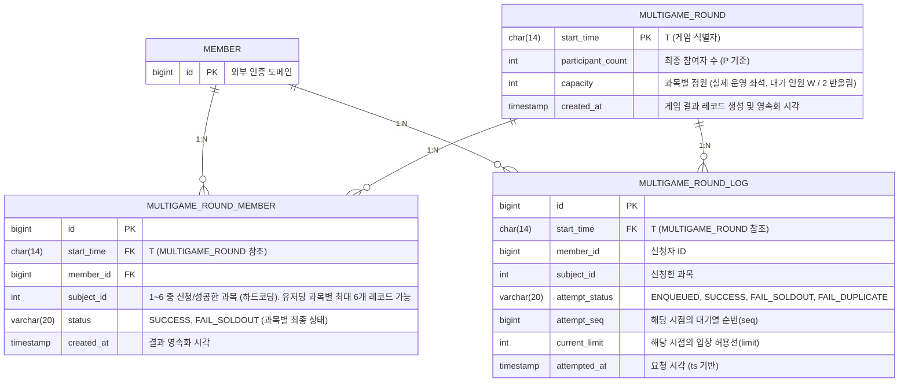

## Layer 0: 시스템 2단계 분리 (게임중, 결과)

본 시스템은 **게임, 결과** 2가지 단계로 완전히 분리되어 동작합니다. 게임중 사용하는 **식별자 T(게임 시작 시각)와 상태(State Machine)는 오직 '게임중' 단계에만 종속**됩니다. 결과 단계는 게임의 상태와 무관하게 독립적으로 동작하는 단순 CRUD 데이터 처리 영역입니다.

1. **게임중 (Game)**
   - **책임:** 식별자 T를 기준으로 게임의 생명주기(Lifecycle)를 관리하고 실시간 유저 요청을 처리합니다.
   - **T와 State의 종속성:** 시스템에서 유일하게 T(10분 단위 시작 시각)를 가집니다.
   - **동작:** 3개의 Cron이 10분 주기로 깨어나 Advisory Lock을 통해 단 1대의 인스턴스만 상태를 전이시키며 Supply 루프를 실행합니다. 게임 종료 시점(T+30s)에는 결과를 DB에 영속화(Upsert 및 Batch Insert)하고 Redis의 게임 데이터를 완전히 초기화합니다. 이후 시간이 흘러 다음 게임 대기 시간대(T+1m)에 진입하면 자동으로 대기 상태가 됩니다.
   - **운영 시간:** 새벽 2시 ~ 5시는 게임이 생성되지 않으며, 시스템이 `CLOSED` 상태로 진입합니다.
2. **결과 (Result)**
   - **책임:** 게임 종료 후, DB에 영속화된 최종 결과 데이터를 유저가 **조회 및 확인**하는 역할만 수행합니다.
   - **상태 무관성:** '게임중' 단계에서 DB에 결과가 기록되고 나면, 이후의 결과 확인 과정은 게임의 상태나 Redis와 무관하게 완전히 분리됩니다. 단순히 DB에 저장된 정산 결과를 읽어오는 읽기 전용(Read-only) 영역으로 취급됩니다.

---

## RDB 스키마 (ERD)



### 스키마 상세 설명

1. **MULTIGAME_ROUND (게임 메타 정보)**
   - `endingCron`이 게임 종료 시점(`T+30s`)에 생성합니다.
   - 해당 게임(`T`)의 최종 참여자 수(`participant_count`, P 기준)와 **실제 운영된 과목별 좌석(`capacity`, readyCron의 W 기준 `round(W / 2)`)**을 스냅샷으로 저장합니다. (게임 시작 시점에 좌석으로 깔린 값 그대로 기록 — 종료 시점의 P로 다시 계산하지 않으므로, 이후 로그 분석 시 "그 게임의 좌석은 몇 개였는가"가 명확합니다.)
   - 게임당 단 1개의 레코드만 가지며, 식별자는 `start_time`(T)입니다.
2. **MULTIGAME_ROUND_MEMBER (유저·과목별 최종 결과)**
   - `endingCron`이 Redis의 이벤트 로그를 분석하여 **(유저, 과목) 단위** 최종 상태를 Upsert 하는 테이블입니다. 한 라운드에서 한 유저는 과목별로 각각 성공할 수 있어 **최대 6개 레코드**(과목 1~6 각각 1건)를 가질 수 있습니다.
   - `MULTIGAME_ROUND`의 `start_time`을 외래키로 참조합니다.
   - `start_time`(T), `member_id`, `subject_id`를 복합 유니크 키로 사용하여 멱등성을 보장합니다.
   - `status`는 `SUCCESS`, `FAIL_SOLDOUT`만 기록됩니다. (같은 과목 중복 신청 실패인 `FAIL_DUPLICATE`는 해당 과목에 이미 성공한 유저에게만 발생하므로, 과목별 최종 상태는 `SUCCESS` 또는 `FAIL_SOLDOUT`이 됩니다. 시간 내 처리되지 못하고 큐에 남은 시도는 `FAIL_SOLDOUT`으로 처리됩니다.)
3. **MULTIGAME_ROUND_LOG (모든 신청 시도 기록)**
   - `endingCron`이 Redis의 `event_log:stream`에 쌓인 모든 이벤트를 읽어 Batch Insert 하는 로그 테이블입니다.
   - 폴링(PENDING)으로 인한 무의미한 로그는 기록되지 않으며, 상태가 전이되는 시점(최초 진입, 성공, 실패)의 이벤트만 보관됩니다.

---

## Layer 1: 게임중 Lifecycle (Time-Driven State Machine)

### 전제 및 철학

본 문서는 게임 lifecycle을 관리하는 **Layer 1** 문서입니다. 본 시스템의 핵심 철학은 **"시간이 곧 상태다"** 이라는 원칙입니다. 서버는 현재 시간(`now`)을 기준으로 **시간대(Phase)** 를 1차로 도출하며, 특정 시간대부터는 **Redis 상태(State)** 를 2차로 조회하여 최종 상태를 평가합니다. API 들은 이 상태를 반환합니다.

### T 자동 계산

T는 10분 마크(`:00`, `:10`, `:20`, `:30`, `:40`, `:50`)이며, **서버가 `now` 기준으로 자동 계산**합니다. 요청 정보 어디에도 T는 포함되지 않습니다. 하나의 게임 라이프사이클(대기 ~ 정산)은 총 10분이 소요되며, `now`의 분(minute) 값을 통해 아래 규칙에 따라 타겟 T를 산출합니다.

`now`의 분(minute) 값을 10으로 나눈 나머지를 `M` (0 ~ 9)이라고 할 때:

1. **`M <= 1` 인 경우 (`:00` ~ `:01` 구간)**
   - `now`는 직전 10분 마크에 시작된 게임의 **진행 또는 정산 기간**(`T ~ T+1m`)에 속합니다.
   - **타겟 T = `now`의 직전 10분 마크**
2. **`M > 1` 인 경우 (`:02` ~ `:09` 구간)**
   - `now`는 다음 10분 마크에 시작될 게임의 **대기 또는 준비 기간**(`T-9m ~ T`)에 속합니다.
   - **타겟 T = `now`의 다음 10분 마크**

이 단순 분배 규칙을 통해 시스템은 `now`라는 시간만으로 유일한 타겟 T를 즉각적으로 산출하며, **동시에 진행되는 게임은 최대 1개**임을 보장합니다.

### 용어 정의 (참여자 수의 분화)

1. **W = wating_participants (대기방 참여자 수)**
   - 대기방 API 폴링 시 `heartbeat` ZSET에 현재 타임스탬프와 함께 갱신된 유저의 수입니다.
   - `readyCron`(T-5s) 시점에 만료된(4초 이상 경과) 데이터를 삭제(`ZREMRANGEBYSCORE`)한 후 `ZCARD`를 통해 카운트되며, 게임 개최 여부(2명 이상) 및 Supply Engine의 **초기 공급량** 산정에 사용됩니다.
2. **P = progress_participants (진행 참여자 수)**
   - `PROGRESS` 상태에서 유저가 직접 **진입 API**를 호출하여 메인 방에 들어온 실시간 참여자 수입니다.
   - Supply Engine은 이 값을 **총 공급의 상한선**으로 사용합니다.
   - `endingCron`에서 DB에 스냅샷으로 저장되는 `participant_count`는 이 값입니다.

### Time Phase & Redis State 정의

시간의 흐름을 나타내는 **Phase**와 Redis에 명시적으로 기록되는 **State**를 분리합니다.

| Time Phase         | 시간 구간 (T 기준)   | Redis 조회 여부 | 설명                                                 |
| ------------------ | -------------- | ----------- | -------------------------------------------------- |
| **CLOSED_PHASE**   | 새벽 2시 ~ 5시     | ❌ 안 함       | 미운영 시간. 시간만으로 판단                                   |
| **WAITING_PHASE**  | `T-9m ~ T-5s`  | ❌ 안 함       | 대기 모집 구간. 시간만으로 "모집 중"임을 판단                        |
| **READY_PHASE**    | `T-5s ~ T`     | ✅ 조회함       | 게임 시작 직전. Redis에 `CANCELLED`가 있는지 확인               |
| **PROGRESS_PHASE** | `T ~ T+30s`    | ✅ 조회함       | 게임 진행 구간. Redis에 `CANCELLED` 또는 `PROGRESS`가 있는지 확인 |
| **ENDED_PHASE**    | `T+30s ~ T+1m` | ❌ 안 함       | 게임 종료 및 정산 구간. 시간만으로 "종료됨(ENDED)"을 판단              |

| Redis State 값  | 의미                                     | 세팅 주체           |
| --------------- | ---------------------------------------- | ------------------- |
| **`READY`**     | 최소 인원(W ≥ 2) 충족, 게임 시작 대기 중 | `readyCron` (T-10s) |
| **`CANCELLED`** | 최소 인원 미달(W < 2), 게임 취소됨       | `readyCron` (T-10s) |
| **`PROGRESS`**  | 게임이 정상적으로 시작됨                 | `progressCron` (T)  |

### 상태 평가 매트릭스 (Time vs Redis)

서버는 아래 매트릭스에 따라 최종 판정 상태를 도출합니다. **`STARTING`** 상태는 Cron 지연으로 인해 시간이 지났으나 Redis 상태가 아직 업데이트되지 않은 과도기를 처리하기 위한 가상 상태입니다.

| Time Phase       | Redis State     | 최종 판정 상태      | 대기방 API 응답                | 진입 / 신청 API      | 이탈 API |
| ---------------- | --------------- | ------------- | ------------------------- | ---------------- | ------ |
| `CLOSED_PHASE`   | (조회 안 함)        | **CLOSED**    | "운영 시간 아님"                | `BLOCK`          | NO-OP  |
| `WAITING_PHASE`  | (조회 안 함)        | **WAITING**   | "대기 모집 중"                 | `BLOCK`          | NO-OP  |
| `READY_PHASE`    | `CANCELLED`     | **CANCELLED** | "최소인원 미달 취소됨"             | `BLOCK`          | NO-OP  |
| `READY_PHASE`    | `READY`          | **READY**     | "준비 완료"                   | `BLOCK`          | NO-OP  |
| `READY_PHASE`    | `없음` (Cron 지연)  | **STARTING**  | "게임 시작 준비 중. 잠시만 기다려주세요." | `BLOCK`          | NO-OP  |
| `PROGRESS_PHASE` | `CANCELLED`     | **CANCELLED** | "최소인원 미달 취소됨"             | `BLOCK`          | NO-OP  |
| `PROGRESS_PHASE` | `PROGRESS`      | **PROGRESS**  | "게임 진행 중"                 | `ALLOW`          | P=P-1  |
| `PROGRESS_PHASE` | `READY` 또는 `없음` | **STARTING**  | "게임 시작 중. 잠시만 기다려주세요."    | `BLOCK` (재시도 유도) | NO-OP  |
| `ENDED_PHASE`    | (조회 안 함)        | **ENDED**     | "정산 중"                    | `BLOCK`          | NO-OP  |

### 분산환경과 Lock

- **모든 인스턴스**에서 동일한 `@Scheduled cron`으로 구동됩니다.
- 각 Job은 진입 즉시 `pg_try_advisory_lock(action.hashCode(), T.hashCode())`를 시도합니다. (싱글톤 보장)
- Lock은 **트랜잭션 단위로 유지**되며 커밋 시 해제됩니다.
- **`progressCron`만 예외적으로 Session-level Lock을 30초간 유지**하여 Supply Engine 중복 실행을 방지합니다.

### Cron 매커니즘 및 상세 동작 (3개의 Cron)

상태를 시간에 맡겼기 때문에, Cron은 상태를 주기적으로 밀어 넣는 역할이 아니라 **"T-5s 판단"**, **"T 시작"**, **"T+30s 정산"** 역할만 수행합니다.

#### 1. `readyCron`: 게임 확정 (T-5s 실행, `55 9/10 * * * *`)

- **목적:** 대기 인원을 체크하여 게임 진행 여부를 Redis에 확정합니다.
- **동작:**
  1. 현재 T가 새벽 2~5시면 no-op.
  2. `multigame:round:heartbeat:ledger` ZSET에서 현재 시간 기준 3,000ms 이전의 데이터를 `ZREMRANGEBYSCORE`로 삭제하여 만료된 유저를 정리(GC)합니다.
  3. `ZCARD`를 통해 유효한 대기자 수(W)를 카운트합니다. (삭제 및 카운트 과정은 원자성을 보장하기 위해 Lua 스크립트로 일괄 실행합니다.)
  4. **IF W ≥ 2:** `state`를 `READY`로 세팅하고, `multigame:round:waiting_count:cache`에 W 저장.
  5. **IF W < 2:** `state`를 `CANCELLED`로 세팅. (이후 `progressCron`, `endingCron`은 no-op가 됨)

#### 2. `progressCron`: 게임 시작 및 데이터 초기화 (T 실행, `0 0/10 * * * *`)

- **목적:** 확정된 게임을 시작하고, 이전 게임의 찌꺼기를 완벽히 지웁니다.
- **동작:**
  1. 현재 T가 새벽 2~5시면 no-op.
  2. Redis `state` 확인:
     - `CANCELLED`이면 no-op.
     - `READY`가 아니면 (키 없음 등) 비정상이므로 `CANCELLED` 세팅 후 종료.
  3. **[핵심 초기화]** `startProgress`가 게임 데이터 키(`participants`, `queue`, `seq`, `limit`, `seats`, `success_members`, `event_log`)를 `DEL`로 지우고 `seq=0`, `limit=0`으로 재세팅. 단, **`heartbeat`와 `waiting_count`는 이 시점에 지우지 않는다** — `waiting_count`(W)는 종료 시점에 `capacity` 재산정용으로 보존되며, `heartbeat`는 `endingCron`의 전역 키 정리(`clear()`)에서 제거된다.
  4. **좌석 초기화:** `seats` Hash의 과목별 정원을 `max(1, round(W / 2))`로 세팅. (W = readyCron이 `waiting_count:cache`에 저장한 대기 인원 스냅샷 — 종료 시 DB `capacity`에도 동일 값이 기록됨)
  5. `state`를 `PROGRESS`로 세팅.
  6. Supply Engine 30초 루프 실행 (매초 `admission_limit` 계산).

#### 3. `endingCron`: 게임 종료 및 정산 (T+30s 실행, `30 0/10 * * * *`)

- **목적:** 게임을 멈추고 DB에 모든 이벤트 로그와 최종 결과를 영속화합니다.
- **동작:**
  1. 현재 T가 새벽 2~5시면 no-op.
  2. `now` 시간을 기반으로 타겟 T 산출 (별도 Redis 조회 없음).
  3. Redis `state` 확인: `PROGRESS`가 아니면 no-op. (이미 취소되었거나 닫힌 경우)
  4. `LRANGE multigame:round:event_log:stream 0 -1` 을 통해 모든 신청 이벤트 로그를 조회합니다.
  5. Java 애플리케이션에서 로그를 순회하며 두 가지 작업을 수행합니다.
     - **`MULTIGAME_ROUND_LOG` 테이블:** 전체 로그를 JDBC Batch Insert 합니다.
     - **`MULTIGAME_ROUND_MEMBER` 테이블:** **(유저, 과목) 키**를 갖는 Map을 만들어 과목별 최종 상태(우선순위: SUCCESS > FAIL_SOLDOUT > FAIL_DUPLICATE > ENQUEUED)로 덮어쓴 뒤 Upsert 합니다. 단, 최종적으로 큐에 남아 처리되지 못한 시도는 `FAIL_SOLDOUT`으로 기록합니다. (같은 과목 중복 신청 실패인 `FAIL_DUPLICATE`는 해당 과목에 이미 성공한 유저에게만 발생하므로, 과목별 최종 상태는 `SUCCESS` 또는 `FAIL_SOLDOUT`이 됩니다.) 한 유저가 여러 과목에 성공하면 과목 수만큼 레코드가 생성됩니다.
  6. `MULTIGAME_ROUND` 테이블에 메타 정보(participant_count=P, capacity=실제 운영 좌석 `round(W / 2)`)를 Upsert 합니다.
  7. **[데이터 정리]** `runtimeStore.clear()`가 현재 게임의 **전체 전역 키**(`state`, `heartbeat`, `waiting_count`, `participants`, `queue`, `seq`, `limit`, `seats`, `success_members`, `event_log`)를 `DEL`로 초기화합니다. 대기방 heartbeat도 이 시점에 정리됩니다. 이후 시간이 흘러 다음 게임 대기 시간대(T+1m)에 진입하면 자동으로 대기 상태가 됩니다.

---

## Layer 2: API 설계 및 명세

모든 API는 언제나 호출할 수 있다는 가정하에 설계합니다. 프론트 엔드는 대기방에서 API를 통해 상태를 사용자에게 보여줍니다. 사용자는 시간이 되면 진입(진입 API, 일종의 허가)을 합니다. 메인 방에서 강좌 신청 API를 쏩니다.

### API 상태별 응답 매트릭스

| 최종 판정 상태 | `GET /waiting-room` (대기방)           | `POST /enter` (진입)              | `POST /leave` (이탈)         | `POST /apply` (신청)       |
| -------------- | -------------------------------------- | --------------------------------- | ---------------------------- | -------------------------- |
| **CLOSED**     | `CLOSED` 응답 ("운영 시간 아님")       | 409 ERROR (운영 시간 아님)        | 200 OK (No-op)               | `{'BLOCKED', 'CLOSED'}`    |
| **WAITING**    | `WAITING` 응답 + heartbeat 갱신        | 409 ERROR (진행 중 아님)          | 200 OK (No-op)               | `{'BLOCKED', 'WAITING'}`   |
| **READY**      | `READY` 응답 + heartbeat 갱신          | 409 ERROR (진행 중 아님)          | 200 OK (No-op)               | `{'BLOCKED', 'READY'}`     |
| **STARTING**   | `STARTING` 응답 ("시작 중, 대기 요청") | 409 ERROR (진행 중 아님)          | 200 OK (No-op)               | `{'BLOCKED', 'STARTING'}`  |
| **PROGRESS**   | `PROGRESS` 응답 (버튼 활성화 유도)     | 200 OK (메인 방 데이터, `P` 증가) | 200 OK (`P` 감소 및 큐 제거) | Lua 6단계 로직 수행        |
| **ENDED**      | `ENDED` 응답 (다음 대기 유도)          | 409 ERROR (게임 종료됨)           | 200 OK (No-op)               | `{'BLOCKED', 'ENDED'}`     |
| **CANCELLED**  | `CANCELLED` 응답 (다음 대기 유도)      | 410 ERROR (게임 취소됨)           | 200 OK (No-op)               | `{'BLOCKED', 'CANCELLED'}` |

---

### Layer 2-1: 대기방 (Waiting)

- **목적:** 게임 시작 전 클라이언트가 대기하며 접속을 유지하는 공간. 프론트엔드는 2초 간격으로 폴링합니다.
- **API:** `GET /api/v1/multigame/session/waiting-room`
- **동작:** 서버는 현재 시각 기준 타겟 T를 계산하여 **Time Phase**를 도출합니다. `READY_PHASE`와 `PROGRESS_PHASE` 구간에서는 Redis를 조회하여 최종 판정 상태를 반환합니다. `WAITING` 또는 `READY` 상태일 때만 heartbeat를 갱신합니다.
- **Heartbeat 갱신 방식:** `ZADD multigame:round:heartbeat:ledger {current_timestamp_ms} {userId}` 명령을 통해 단일 ZSET에 유저의 생존을 기록합니다. 만료된 데이터는 TTL이 아닌 `readyCron`에서 `ZREMRANGEBYSCORE`를 통해 주기적으로 청소됩니다.

**응답 명세:**

| 시간 구간 (Phase)         | 최종 상태     | 응답 예시                                                    | 프론트 액션                     |
| ------------------------- | ------------- | ------------------------------------------------------------ | ------------------------------- |
| T-9m ~ T-5s (`WAITING`)   | `WAITING`     | `{ "multigameId": "T", "state": "WAITING", "participation": 23 }` | 대기 UI 유지, 2초 하트비트 전송 |
| T-5s ~ T (`READY`)        | `READY`       | `{ "multigameId": "T", "state": "READY", "participation": 23 }` | "곧 시작됩니다" UI 노출         |
| T ~ T+30s (`PROGRESS`)    | `PROGRESS`    | `{ "multigameId": "T", "state": "PROGRESS", "participation": 23 }` | **"게임 입장하기" 버튼 활성화** |
| T+30s ~ T+1m (`ENDED`)    | `ENDED`       | `{ "multigameId": "T", "state": "ENDED", "participation": 23 }` | "게임 종료, 다음 대기" UI 노출  |
| (예외) 2시~5시            | `CLOSED`      | `{ "state": "CLOSED" }`                                       | "운영 시간 아님" UI 노출        |

### Layer 2-2: 진입 및 이탈 (Enter & Leave)

- **목적:** 유저가 직접 메인 방으로 진입하는 액션. 이 API를 호출한 유저만이 실제 게임 참여자(P)로 마킹됩니다.
- **진입 API:** `POST /api/v1/multigame/session/enter`
  - **동작:** 상태 평가 결과가 `PROGRESS`인지 검문. 맞으면 `multigame:round:participants:ledger` (Set)에 유저 ID 추가하고 메인 방 데이터 반환.
  - **응답:** `200 OK` (메인 방 데이터), `409 ERROR` (게임 진행 중 아님), `410 ERROR` (게임 취소됨)
- **나가기 API:** `POST /api/v1/multigame/session/leave`
  - **동작:** `multigame:round:participants:ledger`에서 유저 ID 제거. 대기열(`multigame:round:queue:ledger`)에 남아 있는 해당 유저의 **과목별 대기 항목(`{userId}:{subjectId}`) 전부**를 제거하여 불필요한 대기/공급을 방지합니다.
  - **응답:** `200 OK`

### Layer 2-3: Progress & Request Thread (Lua 1-Trap)

- **목적:** 메인 방에 진입한 유저가 과목을 신청하는 실시간 경쟁 로직. 클라이언트는 동일한 요청을 계속 쏩니다.
- **API:** `POST /api/v1/multigame/session/apply`
- **진입 검증 (서비스 레이어):** Lua 스크립트 실행 전 2단계 검증을 수행합니다.
  1. 상태 평가 결과가 `PROGRESS`가 아니면 Lua를 실행하지 않고 `{'BLOCKED', state}`를 즉시 반환합니다.
  2. `multigame:round:participants:ledger`에 유저가 마킹되어 있는지(진입 API 호출 여부) 확인하며, 미진입 유저의 신청은 `MULTIGAME_GAME_INVALID_STATE`로 거부됩니다. 이 가드는 대기열을 우회한 미진입 신청을 차단합니다.

#### 데이터 특성 명확화

- **절댓값 (Absolute):**
  - `score` (ZSET 점수) = `seq` (시도 순번): **(유저, 과목) 시도**가 대기열에 등록된 순간 부여받은 고유 번호. 같은 유저라도 과목별로 각각 새 시도로 인식되어 서로 다른 `seq`를 받는다.
  - `limit` (진입 허용선): Supply Engine이 누적해서 증가시키는 총 입장 허용 시도 수
- **상댓값 (Relative):**
  - `L` (큐의 길이): 현재 대기열에 실제로 대기 중인 **시도**(유저:과목)의 수.

#### Lua 스크립트 (상태 전이 시점에만 이벤트 로깅)

*(주의: 전역 키(Global Key)를 사용하므로, 애플리케이션에서 KEYS 배열에 T가 포함되지 않은 전역 키 문자열을 그대로 넘겨주어야 합니다. PENDING 응답 시에는 로그를 남기지 않아 폴링 노이즈를 제거합니다.)*

```lua
-- 파라미터: KEYS[1]=state, KEYS[2]=queue, KEYS[3]=seq,
--           KEYS[4]=limit, KEYS[5]=seats, KEYS[6]=success_members,
--           KEYS[7]=event_log
--           ARGV[1]=member(유저ID), ARGV[2]=subject_id(과목 1~6), ARGV[3]=ts(현재 타임스탬프)
--
-- 반환 형식:
-- - BLOCKED:        {'BLOCKED', current_state}
-- - PENDING:        {'PENDING', seq, limit}
-- - SUCCESS:        {'SUCCESS', subject_id, remaining}
-- - FAIL_SOLDOUT:   {'FAIL_SOLDOUT', subject_id}
-- - FAIL_DUPLICATE: {'FAIL_DUPLICATE', subject_id}

-- 1. 상태 검문
local state = redis.call('GET', KEYS[1])
if state ~= 'PROGRESS' then
    return {'BLOCKED', state}
end

-- 2. 대기열 재진입 및 기존 순번 확인
--    대기열 키는 (유저, 과목) 단위: 한 라운드에서 과목별로 각각 신청/성공이 가능하다
local attempt = ARGV[1] .. ':' .. ARGV[2]
local seq = redis.call('ZSCORE', KEYS[2], attempt)
if not seq then
    -- 큐에 없으면 신규 등록 (유저가 과목을 바꿔 신청하면 새로운 시도로 취급)
    seq = redis.call('INCR', KEYS[3])
    redis.call('ZADD', KEYS[2], seq, attempt)

    -- [이벤트 로깅] 최초 대기열 진입 시 1회만 로그를 남김 (상태: ENQUEUED)
    redis.call('RPUSH', KEYS[7], ARGV[1]..':ENQUEUED:'..ARGV[2]..':'..ARGV[3]..':'..seq..':0')
end

-- 3. 진입 허용선 확인
local limit = tonumber(redis.call('GET', KEYS[4]) or '0')
if tonumber(seq) > limit then
    -- PENDING일 때는 로그를 남기지 않고 바로 반환 (폴링 노이즈 방지)
    return {'PENDING', seq, limit}
end

-- 4. 중복 수강 검증 (같은 과목만 차단. 다른 과목은 별도로 성공 가능)
if redis.call('SISMEMBER', KEYS[6], attempt) == 1 then
    redis.call('ZREM', KEYS[2], attempt)
    redis.call('RPUSH', KEYS[7], ARGV[1]..':FAIL_DUPLICATE:'..ARGV[2]..':'..ARGV[3]..':'..seq..':'..limit)
    return {'FAIL_DUPLICATE', ARGV[2]}
end

-- 5. 좌석 차감
local remaining = redis.call('HINCRBY', KEYS[5], ARGV[2], -1)

if remaining >= 0 then
    -- 성공 (유저:과목 쌍을 성공 집합에 기록)
    redis.call('SADD', KEYS[6], attempt)
    redis.call('ZREM', KEYS[2], attempt)
    redis.call('RPUSH', KEYS[7], ARGV[1]..':SUCCESS:'..ARGV[2]..':'..ARGV[3]..':'..seq..':'..limit)
    return {'SUCCESS', ARGV[2], remaining}
else
    -- 정원 초과 (차감 복구)
    redis.call('HINCRBY', KEYS[5], ARGV[2], 1)
    redis.call('ZREM', KEYS[2], attempt)
    redis.call('RPUSH', KEYS[7], ARGV[1]..':FAIL_SOLDOUT:'..ARGV[2]..':'..ARGV[3]..':'..seq..':'..limit)
    return {'FAIL_SOLDOUT', ARGV[2]}
end
```

---

### Layer 2-4: Supply Engine (적응형 공급 엔진)

### 전제 및 목표

- **게임 시간:** 30초 (`T` ~ `T+30s`)
- **환경 변수 (3가지):**
  1. `W` (wating_participants): `readyCron`(T-5s)에서 저장한 대기방 인원 수 스냅샷. (초기 폭발 공급량 산정)
  2. `P` (progress_participants): `PROGRESS` 상태에서 진입 API를 호출한 실시간 참여자 수. (총 공급 상한 `6P`의 기반 — 과목별 시도를 고려)
  3. `L`: 매초 조회하는 대기열의 길이(대기 중인 **시도** 수, 유저:과목 단위). (초당 공급 속도 결정)
- **목표 (UX):**
  1. 메인 방에 진입한 유저(`P`)는 게임 종료 전까지 **반드시 100% 처리**한다.
  2. 대기자가 많을 경우 초기 20%만 즉시 입장시켜 80%에게 대기 경험을 제공한다.
  3. 대기자의 평균 체감 대기시간은 약 2초, 최대 대기시간은 약 4초를 목표로 한다.

### 수학적 모델 (W, P, L을 결합한 3중 피드백 제어)

1. **초기값 (t=0):** 

   - `readyCron`에서 스냅샷으로 저장해둔 `W`를 읽어와 초기 허용량을 설정합니다.
   - 전체 대기자의 20%만 즉시 입장시킵니다. (최소 1명 보장)

   Limit_0 = $\max\left(1, \lfloor W \times 0.2 \rfloor\right)$

2. **정상 공급 구간 (1초 ~ 25초):**

   - **목표:** 현재 대기자를 4초 안에 처리하도록 속도를 제어.

   Supply_t = $\left\lceil \frac{L_t}{4} \right\rceil$

   - **제어 (P의 활용):** 과목별 신청이 가능하므로, 발급된 총 허용량(`limit`)은 현재 메인 방 유저가 만들 수 있는 **총 시도 수(`6 × P`)** 를 넘을 필요가 없습니다.

   Limit_t = $\min(6 \cdot P_t, Limit_{t-1} + Supply_t)$

   - 단, `L == 0` 일 경우 `Supply_t = 0`으로 하여 불필요한 `limit` 상승을 방지합니다.

3. **임계 보정 구간 (26초 ~ 29초, 잔여 시간 `R`이 4초 미만일 때):**

   - **목표:** 게임 종료까지 남은 시간 안에 메인 방에 있는 모든 유저(`P`)를 강제로 처리.

   Supply_t = $\left\lceil \frac{L_t}{R} \right\rceil$

   Limit_t = $\min(6 \cdot P_t, Limit_{t-1} + Supply_t)$

### 공급 예시

#### 케이스 1: 대기방에 100명 대기 후 게임 시작 (`W = 100`)

- `t=0`: `W=100`이므로 `Limit_0 = 20`. (20명 즉시 통과, `L=80` 남음)
- `t=1`: `P=100` (모두 진입 완료 가정), `L=80`. `supply = ceil(80/4) = 20`. `Limit = min(600, 20+20) = 40`.
- `t=2`: `P=100`, `L=60`. `supply = 15`. `Limit = min(600, 40+15) = 55`.
- **결과:** 초기 20% 즉시 입장 후, 총 시도 수 상한(`6P=600`) 내에서 4초 이내 처리 원칙 준수.

#### 케이스 2: 트래픽 지연 후반 몰림 (T-5s에는 2명, T+15s에 100명 진입)

- `t=0`: `W=2`이므로 `Limit_0 = 1`.
- `t=1~14`: `P=2`, `L=1`. `supply = 1`. 상한 `6P = 12`. `Limit = min(12, 1+t)` → t=11에서 `12`로 막힘. (2명이 만들 수 있는 총 시도 수)
- `t=15`: 100명 진입. `P=100`, `L=99`. `supply = ceil(99/4) = 25`. `Limit = min(600, 12+25) = 37`.
- **결과:** 극단적 트래픽 지연에도 `6P` 상한선 덕분에 자원 낭비 없이 4초 대기 원칙 준수.

### 실행 메커니즘 (ProgressJob 내 루프)

`progressCron`은 Session-level Lock을 30초간 점유하며, 매초 `P`와 `L`을 조회하여 `admission_limit`를 동적으로 계산합니다. 전역 키를 사용하므로 `{T}` 조합 없이 고정된 키를 사용합니다.

```java
public void executeSupplyEngine(String T) {
    // 1. readyCron이 저장해둔 W (wating_participants) 스냅샷 조회 (전역 키)
    String wStr = redis.get("multigame:round:waiting_count:cache");
    long W = wStr != null ? Long.parseLong(wStr) : 0;
    
    // 2. 초기값 설정 (W의 20%, 최소 1명) 후 즉시 반영 (t=0)
    int limit = Math.max(1, (int) Math.floor(W * 0.2));
    redis.set("multigame:round:limit:control", String.valueOf(limit));
    
    // 3. 1초 간격으로 매초 limit 갱신 (t=1 ~ t=29, 총 29회)
    for (int t = 1; t < 30; t++) {
        Thread.sleep(1000);
        
        // 4. 현재 메인 방 진입 인원(P = progress_participants) 조회 (전역 키)
        long P = redis.sCard("multigame:round:participants:ledger");
        
        // 5. 현재 실제 대기 시도 수(L) 조회 (전역 키, 유저:과목 단위)
        long L = redis.zCard("multigame:round:queue:ledger"); 
        
        int remainingTime = 30 - t;
        int supply;
        
        if (L == 0) {
            supply = 0;
        } else if (remainingTime <= 4) {
            // 임계 구간
            supply = (int) Math.ceil((double) L / remainingTime);
        } else {
            // 정상 구간
            supply = (int) Math.ceil((double) L / 4.0);
        }
        
        // 6. limit 업데이트 (총 시도 수 상한 6×P를 넘을 수 없음)
        limit = (int) Math.min(6 * P, limit + supply);
        
        // 7. 진입 허용선(절댓값) 업데이트 (전역 키)
        redis.set("multigame:round:limit:control", String.valueOf(limit));
    }
}
```

---

### Layer 2-5: Redis Key 목록 (전역 키 Global Key)

시스템에선 동시에 진행되는 게임이 최대 1개이므로, 모든 키에서 `{T}`를 제거하고 전역 키를 사용합니다. T 값은 `now` 시간을 통해 산출 가능하므로 별도의 저장 키를 두지 않습니다.

*(주의: `progressCron` 실행 시 새로운 게임을 위해 아래 데이터 키들을 `DEL`로 초기화하며, `endingCron` 종료 시에도 다음 대기 상태 도출을 위해 전체 키를 `DEL`로 초기화합니다.)*

| Key 이름                                   | Data Type | 설명                                           | 관련 레이어         | 비고                                                                                                                                   |
| ---------------------------------------- | --------- | -------------------------------------------- | -------------- | ------------------------------------------------------------------------------------------------------------------------------------ |
| `multigame:round:state:control`          | String    | 게임의 현재 상태 (`READY`, `CANCELLED`, `PROGRESS`) | Layer 1        | 시간 기반 평가 후 조회                                                                                                                        |
| `multigame:round:heartbeat:ledger`       | ZSET      | 대기방 유저 접속 생존 확인                              | Layer 2-1, 1   | **Member: userId, Score: Timestamp(ms)**. 2초 폴링 시 `ZADD` 갱신. `readyCron`에서 만료 데이터(4초 이전) `ZREMRANGEBYSCORE` 삭제 후 `ZCARD`로 카운트(W 산출). |
| `multigame:round:waiting_count:cache`    | String    | `readyCron` 시점의 W 스냅샷                        | Layer 1        | Supply Engine 초기 폭발량 산정용                                                                                                             |
| `multigame:round:participants:ledger`    | Set       | 메인 방 진입 실참여자 P 마킹                            | Layer 2-2, 2-4 | 진입 API 추가, 이탈 API 제거. Supply 상한선                                                                                                     |
| `multigame:round:queue:ledger`           | ZSET      | 실시간 신청 대기열 (유저:과목 단위 시도)                    | Layer 2-3      | **Member: `{userId}:{subjectId}`, Score: seq**. 완료된 요청은 `ZREM`으로 즉시 제거, 이탈 시 유저의 과목별 항목 전부 제거                                              |
| `multigame:round:seq:ledger`             | String    | 시도 고유 순번 발급기 (유저:과목 단위)                     | Layer 2-3      | 절댓값                                                                                                                                  |
| `multigame:round:limit:control`          | String    | 입장 허용선                                       | Layer 2-4      | Supply Engine이 매초 업데이트                                                                                                               |
| `multigame:round:seats:ledger`           | Hash      | 과목별 남은 정원                                    | Layer 2-3      | `HINCRBY` 원자적 차감                                                                                                                     |
| `multigame:round:success_members:ledger` | Set       | 신청 완료 (유저:과목) 쌍 집합                          | Layer 2-3      | 실시간 **같은 과목** 중복 신청 검증용 (O(1)). 다른 과목은 별도로 성공 가능                                                                            |
| `multigame:round:event_log:stream`       | List      | 상태 전이 이벤트 로그 (단일 소스)                         | **Layer 2-3**  | ENQUEUED, SUCCESS, FAIL 시점에만 RPUSH. endingCron에서 Batch Insert 후 삭제                                                                   |
